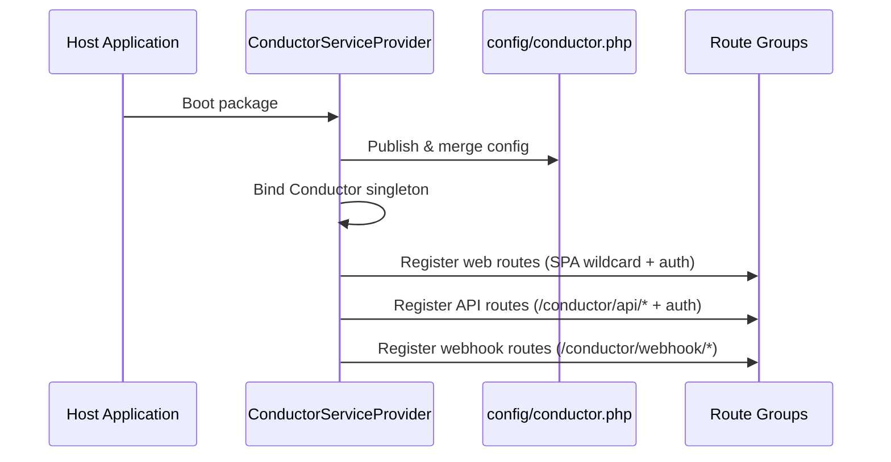
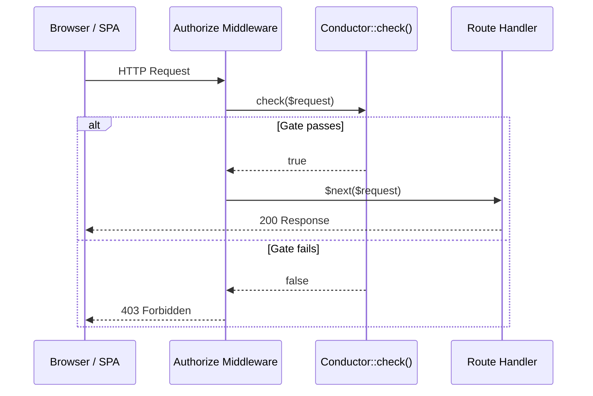

# Phase 1: Package Foundation & Configuration

I have created the following plan after thorough exploration and analysis of the codebase. Follow the below plan verbatim. Trust the files and references. Do not re-verify what's written in the plan. Explore only when absolutely necessary. First implement all the proposed file changes and then I'll review all the changes together at the end.

## Observations

This is a fresh Spatie Laravel Package Tools skeleton (`spatie/laravel-package-tools ^1.16`). Every PHP file uses `declare(strict_types=1)` and `final` classes. The service provider extends `PackageServiceProvider` and uses the fluent `configurePackage(Package $package)` API. Testing uses Pest 4 with Orchestra Testbench (`^10.0.0||^9.0.0`). Migrations use `.php.stub` extensions (Spatie convention). Auto-increment IDs are used. The current namespace is `VendorName\Skeleton` — this phase renames it to `HotReloadStudios\Conductor`. No frontend tooling exists yet beyond commitlint and lefthook. The config file (`config/skeleton.php`) is an empty array.

## Approach

Phase 1 transforms the skeleton into the Conductor package and establishes all foundational infrastructure: configuration schema, service provider, facade with auth gate, authorization middleware, route group registration, and the Blade shell view. The auth gate follows the Horizon pattern — a static closure stored on the main Conductor class, checked by middleware on every dashboard and API request. Routes are registered in three groups (SPA wildcard, API prefix, webhook prefix), but only the SPA shell route is functional in this phase; API and webhook route files are empty placeholders populated in later phases. This phase produces a bootable package that serves an empty dashboard shell behind an auth gate.

The frontend architecture is intentionally not Inertia-based. Conductor is distributed as a reusable package, so the dashboard shell must remain independent of the host application's frontend lifecycle and page protocol. The Blade shell created here is the fixed HTML entry point for a standalone SPA that will later consume Conductor's own JSON endpoints.

---

## - [x] 1. Package Renaming

Rename the skeleton package identity. This can be done by running `php configure.php` or by manually updating:

- `composer.json` — Set `"name"` to `"hotreloadstudios/conductor"`. Update `"description"` to `"Laravel-native background job orchestration with durable workflows, event-driven functions, and realtime visibility."`. Update `autoload.psr-4` namespace from `VendorName\\Skeleton\\` to `HotReloadStudios\\Conductor\\`. Update `autoload-dev.psr-4` from `VendorName\\Skeleton\\Tests\\` to `HotReloadStudios\\Conductor\\Tests\\` and `VendorName\\Skeleton\\Database\\Factories\\` to `HotReloadStudios\\Conductor\\Database\\Factories\\`.
- All PHP files in `src/`, `tests/`, `database/`, `config/` — Replace `VendorName\Skeleton` namespace with `HotReloadStudios\Conductor`.
- Delete `configure.php` after renaming is complete.

---

## - [x] 2. Configuration File

**`config/conductor.php`**

Replace the empty `config/skeleton.php` with `config/conductor.php`. Delete `config/skeleton.php`.

| Key | Type | Default | Description |
|---|---|---|---|
| `path` | string | `'conductor'` | URL prefix for dashboard and API routes |
| `middleware` | array | `['web']` | Middleware applied to all Conductor routes |
| `queue.connection` | string\|null | `null` (app default) | Queue connection for Conductor's internal jobs |
| `queue.queue` | string | `'conductor'` | Queue name for Conductor's internal jobs |
| `prune_after_days` | int | `7` | Days to retain records before pruning |
| `heartbeat_interval` | int | `15` | Worker heartbeat interval in seconds |
| `worker_timeout` | int | `60` | Seconds before a worker is considered offline |
| `redact_keys` | array | `['password', 'token', 'authorization', 'secret', 'api_key', 'cookie', 'x-signature', 'x-hub-signature']` | Keys masked before persisting payloads/logs |
| `functions` | array | `[]` | Registered event functions and scheduled functions |
| `webhooks` | array | `[]` | Registered webhook sources (keyed by source name, each with `secret` and `function` keys) |
| `webhook_rate_limit` | int\|null | `60` | Requests per minute per IP for webhook ingestion; `null` to disable |

The config array must include a comment block above `webhooks` showing an example entry with `secret` and `function` keys.

---

## - [x] 3. Conductor Main Class

**`src/Conductor.php`**

This is the package's primary class, analogous to `Laravel\Horizon\Horizon`. It holds the auth gate closure and provides static methods for gate registration and checking.

**Properties:**

| Property | Visibility | Type | Default |
|---|---|---|---|
| `$authUsing` | protected static | `?Closure` | `null` |

**Methods:**

- `auth(Closure $callback): void` — Stores the given closure in `$authUsing`. The closure receives an `Illuminate\Http\Request` and must return `bool`.
- `check(Request $request): bool` — If `$authUsing` is set, invokes it with the request and returns the result. If `$authUsing` is `null` and the application environment is `local`, returns `true`. Otherwise returns `false`.

Both methods are `public static`. The class is `final`.

---

## - [x] 4. Facade

**`src/Facades/Conductor.php`**

Replace the existing `Skeleton` facade. The facade extends `Illuminate\Support\Facades\Facade`.

- `getFacadeAccessor(): string` — Returns `\HotReloadStudios\Conductor\Conductor::class`.
- PHPDoc block: Add `@see \HotReloadStudios\Conductor\Conductor` and `@method static void auth(\Closure $callback)`.

---

## - [x] 5. Service Provider

**`src/ConductorServiceProvider.php`**

Replace `SkeletonServiceProvider`. Extends `Spatie\LaravelPackageTools\PackageServiceProvider`.

**`configurePackage(Package $package): void`:**

1. `$package->name('conductor')`
2. `->hasConfigFile()` — publishes `config/conductor.php`
3. `->hasViews()` — registers `resources/views/` with `conductor` namespace
4. `->hasMigrations([...])` — registers all migration stubs (populated in Phase 2; for now pass an empty array or omit)
5. `->hasRoute('web')` — loads `routes/web.php` (this only loads the base route file; see section 7 for how API and webhook routes are loaded separately)

**`packageRegistered(): void`:**

1. Bind `Conductor::class` as a singleton in the container: `$this->app->singleton(Conductor::class)`.

**`packageBooted(): void`:**

1. Register the API route group: call `Route::group()` with prefix `config('conductor.path') . '/api'`, middleware `array_merge(config('conductor.middleware'), [Authorize::class])`, and load `__DIR__ . '/../routes/api.php'`.
2. Register the webhook route group: call `Route::group()` with prefix `config('conductor.path') . '/webhook'`, middleware from `config('conductor.middleware')` (no auth — webhooks use signature verification), and load `__DIR__ . '/../routes/webhook.php'`.
3. If the application is not running in `local` and no custom auth callback has been registered on `Conductor`, emit a boot-time warning explaining that Conductor will return `403` for dashboard and API routes until `Conductor::auth()` is configured.

**Note:** The SPA wildcard route in `routes/web.php` applies the auth middleware inline (see section 7). The service provider does not register commands yet — that is deferred to Phase 6 when the Artisan commands are implemented.



---

## - [x] 6. Authorization Middleware

**`src/Http/Middleware/Authorize.php`**

A standard Laravel middleware that gates access to Conductor's dashboard and API routes.

**`handle(Request $request, Closure $next): Response`:**

1. Call `Conductor::check($request)`.
2. If `true`, return `$next($request)`.
3. If `false`, abort with `403`.

The middleware is referenced by its fully qualified class name in route registrations (no alias needed).



---

## - [x] 7. Route Files

Create three route files in the `routes/` directory.

**`routes/web.php`**

Registers the SPA wildcard route within a group that applies:
- Prefix: `config('conductor.path')` (default: `conductor`)
- Middleware: values from `config('conductor.middleware')` plus `HotReloadStudios\Conductor\Http\Middleware\Authorize::class`

The single route: `GET /{any?}` where `any` matches `.*`. This route responds by returning the `conductor::index` Blade view. The controller is a single invokable controller class `src/Http/Controllers/DashboardController.php`.

**`src/Http/Controllers/DashboardController.php`**

Invokable controller. `__invoke(Request $request): Response` returns `view('conductor::index')`. The class is `final`.

**`routes/api.php`**

Empty file with a comment noting it is populated in Phase 7. The route group prefix and middleware are applied by the service provider (section 5).

**`routes/webhook.php`**

Empty file with a comment noting it is populated in Phase 5. The route group prefix and middleware are applied by the service provider (section 5).

**SPA deep-link routing:** The `{any?}` wildcard with `->where('any', '.*')` ensures that direct navigation to paths like `/conductor/jobs/abc-123` returns the Blade shell. The API and webhook route groups are registered before the SPA wildcard in the service provider's `packageBooted()` — since they use distinct prefixes (`/conductor/api/...` and `/conductor/webhook/...`), Laravel's router resolves them before falling through to the wildcard.

---

## - [x] 8. Blade Shell View

**`resources/views/index.blade.php`**

A minimal HTML5 document that serves as the entry point for the React SPA. This is a plain Blade shell, not an Inertia response. Structure:

1. `<!DOCTYPE html>` and `<html lang="en">`
2. `<head>`:
   - Meta charset UTF-8, viewport for responsive width
   - `<title>Conductor</title>`
   - `<meta name="csrf-token" content="{{ csrf_token() }}">`
   - CSS link tag: source path resolved from a Vite manifest file (implemented in Phase 8; for now, include a placeholder comment)
3. `<body>`:
   - `<div id="app"></div>` — React mount point
   - JS script tag: source path resolved from the same Vite manifest (placeholder for now)

The view uses `{{ }}` escaped output only. No `{!! !!}` unescaped output.

The `csrf-token` meta tag enables the SPA to read the CSRF token for `X-XSRF-TOKEN` headers on state-mutating requests (POST, DELETE).

---

## - [x] 9. Tests

### Feature Tests

**`tests/Feature/ServiceProviderTest.php`**

- `it boots the service provider without errors` — Assert the application boots successfully and `ConductorServiceProvider` is in the loaded providers.
- `it registers the conductor config` — Assert `config('conductor.path')` returns `'conductor'` and `config('conductor.functions')` returns an empty array.
- `it merges published config with defaults` — Set a custom config value, assert it is respected while defaults are preserved.

**`tests/Feature/AuthorizationTest.php`**

- `it allows all access in local environment` — Set `app.env` to `local`, do not register a gate. `GET /conductor` should return `200`.
- `it blocks access in production when no gate is configured` — Set `app.env` to `production`, do not register a gate. `GET /conductor` should return `403`.
- `it emits a warning in non-local environments when no gate is configured` — Boot the package in `production` without calling `Conductor::auth()`. Assert the warning is written once to the console output or captured log channel.
- `it allows access when custom gate returns true` — Register `Conductor::auth(fn () => true)`. `GET /conductor` should return `200`.
- `it blocks access when custom gate returns false` — Register `Conductor::auth(fn () => false)`. `GET /conductor` should return `403`.

**`tests/Feature/RoutingTest.php`**

- `it serves the blade shell view at the base conductor path` — `GET /conductor` returns `200` and the response contains `<div id="app">`.
- `it serves the blade shell for deep-linked SPA paths` — `GET /conductor/jobs/some-uuid` returns `200` (not `404`).
- `it reserves the api prefix for API routes` — `GET /conductor/api/jobs` returns `404` (no routes registered yet, but the route group exists).
- `it reserves the webhook prefix for webhook routes` — `POST /conductor/webhook/stripe` returns `404` (no routes registered yet).

### Architecture Tests

**Update `tests/ArchTest.php`** — Add:
- `arch('conductor classes use strict types')->expect('HotReloadStudios\Conductor')->toUseStrictTypes()`
- `arch('conductor classes are final')->expect('HotReloadStudios\Conductor')->toBeFinal()`
- `arch('it will not use debugging functions')` — already exists; keep it.

---

## - [x] 10. Directory Structure Summary

After Phase 1, the package structure is:

```
config/
  conductor.php
resources/
  views/
    index.blade.php
routes/
  api.php
  web.php
  webhook.php
src/
  Conductor.php
  ConductorServiceProvider.php
  Facades/
    Conductor.php
  Http/
    Controllers/
      DashboardController.php
    Middleware/
      Authorize.php
tests/
  ArchTest.php
  Feature/
    AuthorizationTest.php
    RoutingTest.php
    ServiceProviderTest.php
  Pest.php
  TestCase.php
```
