# Phase 2: Data Layer (Migrations, Enums, Models, Factories)

I have created the following plan after thorough exploration and analysis of the codebase. Follow the below plan verbatim. Trust the files and references. Do not re-verify what's written in the plan. Explore only when absolutely necessary. First implement all the proposed file changes and then I'll review all the changes together at the end.

## Observations

Phase 1 established the Conductor package identity: `HotReloadStudios\Conductor` namespace, `config/conductor.php` with all configuration keys, `ConductorServiceProvider` extending `PackageServiceProvider`, the `Conductor` facade with auth gate, `Authorize` middleware, route groups for SPA/API/webhooks, and the Blade shell view. The skeleton uses auto-increment `id` primary keys and `.php.stub` migration files (Spatie convention). Factories use the `fake()` helper. The `TestCase` base class uses Orchestra Testbench with a `guessFactoryNamesUsing` callback mapping models to `HotReloadStudios\Conductor\Database\Factories\{Model}Factory`.

## Approach

Phase 2 creates the complete data layer for Conductor: 9 enums, 11 migration stubs, 11 Eloquent models with relationships and casts, and 11 factories with named states. All tables use auto-increment `id` primary keys. Tables that represent externally-addressable records (`conductor_jobs`, `conductor_workflows`, `conductor_events`, `conductor_workers`) also carry a `uuid` column for route binding and API references. Migrations are ordered so foreign key constraints resolve correctly — parent tables before child tables. The service provider registers all migrations via `hasMigrations()`.

---

## - [ ] 1. Enums

Create all enums in `src/Enums/`. Every enum is `string`-backed with TitleCase keys.

**`src/Enums/JobStatus.php`**

| Case | Value |
|---|---|
| `Pending` | `'pending'` |
| `Running` | `'running'` |
| `Completed` | `'completed'` |
| `Failed` | `'failed'` |
| `CancellationRequested` | `'cancellation_requested'` |
| `Cancelled` | `'cancelled'` |

Add a `public function isTerminal(): bool` method that returns `true` for `Completed`, `Failed`, and `Cancelled`.

**`src/Enums/WorkflowStatus.php`**

| Case | Value |
|---|---|
| `Pending` | `'pending'` |
| `Running` | `'running'` |
| `Waiting` | `'waiting'` |
| `Completed` | `'completed'` |
| `Failed` | `'failed'` |
| `Cancelled` | `'cancelled'` |

Add `isTerminal(): bool` — returns `true` for `Completed`, `Failed`, `Cancelled`.

**`src/Enums/StepStatus.php`**

| Case | Value |
|---|---|
| `Pending` | `'pending'` |
| `Running` | `'running'` |
| `Completed` | `'completed'` |
| `Failed` | `'failed'` |
| `Skipped` | `'skipped'` |

Add `isTerminal(): bool` — returns `true` for `Completed`, `Failed`, `Skipped`.

**`src/Enums/LogLevel.php`**

| Case | Value |
|---|---|
| `Debug` | `'debug'` |
| `Info` | `'info'` |
| `Warning` | `'warning'` |
| `Error` | `'error'` |

**`src/Enums/EventRunStatus.php`**

| Case | Value |
|---|---|
| `Pending` | `'pending'` |
| `Running` | `'running'` |
| `Completed` | `'completed'` |
| `Failed` | `'failed'` |

**`src/Enums/ScheduleRunStatus.php`**

| Case | Value |
|---|---|
| `Completed` | `'completed'` |
| `Failed` | `'failed'` |

**`src/Enums/WebhookLogStatus.php`**

| Case | Value |
|---|---|
| `Received` | `'received'` |
| `Verified` | `'verified'` |
| `Processed` | `'processed'` |
| `Failed` | `'failed'` |

**`src/Enums/MetricType.php`**

| Case | Value |
|---|---|
| `Throughput` | `'throughput'` |
| `FailureRate` | `'failure_rate'` |
| `QueueDepth` | `'queue_depth'` |

**`src/Enums/WorkerStatus.php`**

This enum represents the derived status of a worker (computed at query time, never stored in the database).

| Case | Value |
|---|---|
| `Idle` | `'idle'` |
| `Busy` | `'busy'` |
| `Offline` | `'offline'` |

---

## - [ ] 2. Migrations

Create all migration stubs in `database/migrations/`. Delete the existing `create_skeleton_table.php.stub`. Each file uses the `.php.stub` extension (Spatie convention). Migrations are listed in the order they must run — parent tables before child tables so foreign keys resolve.

Register all migrations in the service provider by updating `configurePackage()` to call `->hasMigrations([...])` with the list of migration stub names (without the `.php.stub` extension).

### 2.1 `create_conductor_jobs_table.php.stub`

| Column | Type | Notes |
|---|---|---|
| `id` | `id()` | Auto-increment PK |
| `uuid` | `uuid()` | |
| `class` | `string('class')` | Fully qualified class name |
| `display_name` | `string('display_name')` | Human-readable label |
| `status` | `string('status')` | Stores `JobStatus` enum value |
| `queue` | `string('queue')->nullable()` | |
| `connection` | `string('connection')->nullable()` | |
| `tags` | `json('tags')->nullable()` | Array of tag strings |
| `payload` | `json('payload')->nullable()` | JSON envelope containing a redacted `display` payload and an encrypted internal `retry` payload |
| `attempts` | `unsignedInteger('attempts')->default(0)` | |
| `max_attempts` | `unsignedInteger('max_attempts')->nullable()` | |
| `cancellable_at` | `timestamp('cancellable_at')->nullable()` | When cooperative cancellation registered |
| `cancellation_requested_at` | `timestamp('cancellation_requested_at')->nullable()` | |
| `cancelled_at` | `timestamp('cancelled_at')->nullable()` | |
| `started_at` | `timestamp('started_at')->nullable()` | |
| `completed_at` | `timestamp('completed_at')->nullable()` | |
| `failed_at` | `timestamp('failed_at')->nullable()` | |
| `duration_ms` | `unsignedInteger('duration_ms')->nullable()` | |
| `error_message` | `text('error_message')->nullable()` | |
| `stack_trace` | `text('stack_trace')->nullable()` | |
| `timestamps()` | | `created_at` and `updated_at` |

**Indexes:**
- `unique('uuid')`
- `index(['status', 'queue'])`
- `index('failed_at')`

### 2.2 `create_conductor_job_logs_table.php.stub`

| Column | Type | Notes |
|---|---|---|
| `id` | `id()` | Auto-increment PK |
| `job_id` | `foreignId('job_id')` | `constrained('conductor_jobs')->cascadeOnDelete()` |
| `level` | `string('level')` | Stores `LogLevel` enum value |
| `message` | `text('message')` | |
| `logged_at` | `timestamp('logged_at')` | |

**Indexes:**
- `index(['job_id', 'logged_at'])`

No `timestamps()` — this table is append-only.

### 2.3 `create_conductor_workflows_table.php.stub`

| Column | Type | Notes |
|---|---|---|
| `id` | `id()` | Auto-increment PK |
| `uuid` | `uuid()` | |
| `class` | `string('class')` | |
| `display_name` | `string('display_name')` | |
| `status` | `string('status')` | Stores `WorkflowStatus` enum value |
| `input` | `json('input')->nullable()` | |
| `output` | `json('output')->nullable()` | |
| `current_step_index` | `unsignedInteger('current_step_index')->default(0)` | |
| `next_run_at` | `timestamp('next_run_at')->nullable()` | For delayed continuations |
| `sleep_until` | `timestamp('sleep_until')->nullable()` | |
| `waiting_for_event` | `string('waiting_for_event')->nullable()` | Reserved for v2 |
| `created_at` | `timestamp('created_at')->nullable()` | |
| `completed_at` | `timestamp('completed_at')->nullable()` | |
| `cancelled_at` | `timestamp('cancelled_at')->nullable()` | |

**No `updated_at`** — workflows track state transitions via dedicated timestamp columns.

**Indexes:**
- `unique('uuid')`
- `index('status')`

### 2.4 `create_conductor_workflow_steps_table.php.stub`

| Column | Type | Notes |
|---|---|---|
| `id` | `id()` | Auto-increment PK |
| `workflow_id` | `foreignId('workflow_id')` | `constrained('conductor_workflows')->cascadeOnDelete()` |
| `conductor_job_id` | `foreignId('conductor_job_id')->nullable()` | `constrained('conductor_jobs')->nullOnDelete()` |
| `name` | `string('name')` | Step name |
| `step_index` | `unsignedInteger('step_index')` | |
| `status` | `string('status')` | Stores `StepStatus` enum value |
| `input` | `json('input')->nullable()` | |
| `output` | `json('output')->nullable()` | |
| `available_at` | `timestamp('available_at')->nullable()` | For delayed steps |
| `attempts` | `unsignedInteger('attempts')->default(0)` | |
| `error_message` | `text('error_message')->nullable()` | |
| `stack_trace` | `text('stack_trace')->nullable()` | |
| `started_at` | `timestamp('started_at')->nullable()` | |
| `completed_at` | `timestamp('completed_at')->nullable()` | |
| `duration_ms` | `unsignedInteger('duration_ms')->nullable()` | |

No `timestamps()`.

**Indexes:**
- `unique(['workflow_id', 'step_index'])`

### 2.5 `create_conductor_events_table.php.stub`

| Column | Type | Notes |
|---|---|---|
| `id` | `id()` | Auto-increment PK |
| `uuid` | `uuid()` | |
| `name` | `string('name')` | Dot-notation event name (e.g. `user.created`) |
| `payload` | `json('payload')->nullable()` | |
| `dispatched_at` | `timestamp('dispatched_at')` | |

No `timestamps()` — events are immutable once created.

**Indexes:**
- `unique('uuid')`
- `index(['name', 'dispatched_at'])`

### 2.6 `create_conductor_event_runs_table.php.stub`

| Column | Type | Notes |
|---|---|---|
| `id` | `id()` | Auto-increment PK |
| `event_id` | `foreignId('event_id')` | `constrained('conductor_events')->cascadeOnDelete()` |
| `conductor_job_id` | `foreignId('conductor_job_id')->nullable()` | `constrained('conductor_jobs')->nullOnDelete()` |
| `function_class` | `string('function_class')` | |
| `status` | `string('status')` | Stores `EventRunStatus` enum value |
| `error_message` | `text('error_message')->nullable()` | |
| `attempts` | `unsignedInteger('attempts')->default(0)` | |
| `started_at` | `timestamp('started_at')->nullable()` | |
| `completed_at` | `timestamp('completed_at')->nullable()` | |
| `duration_ms` | `unsignedInteger('duration_ms')->nullable()` | |

No `timestamps()`.

**Indexes:**
- `index('event_id')`
- `index('conductor_job_id')`

### 2.7 `create_conductor_schedules_table.php.stub`

| Column | Type | Notes |
|---|---|---|
| `id` | `id()` | Auto-increment PK |
| `function_class` | `string('function_class')` | |
| `display_name` | `string('display_name')` | |
| `cron_expression` | `string('cron_expression')` | |
| `is_active` | `boolean('is_active')->default(true)` | |
| `last_run_at` | `timestamp('last_run_at')->nullable()` | |
| `next_run_at` | `timestamp('next_run_at')->nullable()` | |
| `last_run_status` | `string('last_run_status')->nullable()` | Stores `ScheduleRunStatus` enum value |
| `timestamps()` | | |

**Indexes:**
- `unique('function_class')`

### 2.8 `create_conductor_workers_table.php.stub`

| Column | Type | Notes |
|---|---|---|
| `id` | `id()` | Auto-increment PK |
| `worker_uuid` | `uuid('worker_uuid')` | |
| `worker_name` | `string('worker_name')` | |
| `queue` | `string('queue')` | |
| `connection` | `string('connection')` | |
| `hostname` | `string('hostname')` | |
| `process_id` | `unsignedInteger('process_id')` | |
| `current_job_uuid` | `string('current_job_uuid')->nullable()` | |
| `last_heartbeat_at` | `timestamp('last_heartbeat_at')` | |
| `timestamps()` | | |

**Indexes:**
- `unique('worker_uuid')`
- `index('last_heartbeat_at')`

### 2.9 `create_conductor_webhook_sources_table.php.stub`

| Column | Type | Notes |
|---|---|---|
| `id` | `id()` | Auto-increment PK |
| `source` | `string('source')` | Unique source identifier (e.g. `stripe`) |
| `function_class` | `string('function_class')` | |
| `is_active` | `boolean('is_active')->default(true)` | |
| `timestamps()` | | |

**Indexes:**
- `unique('source')`

### 2.10 `create_conductor_webhook_logs_table.php.stub`

| Column | Type | Notes |
|---|---|---|
| `id` | `id()` | Auto-increment PK |
| `source` | `string('source')` | References `conductor_webhook_sources.source` |
| `payload` | `json('payload')->nullable()` | |
| `masked_signature` | `string('masked_signature')->nullable()` | |
| `status` | `string('status')` | Stores `WebhookLogStatus` enum value |
| `received_at` | `timestamp('received_at')` | |

No `timestamps()`, no foreign key constraint (uses string-based reference to `source` column; the source value is denormalized for query simplicity and cascade-delete is handled by the prune command).

### 2.11 `create_conductor_metric_snapshots_table.php.stub`

| Column | Type | Notes |
|---|---|---|
| `id` | `id()` | Auto-increment PK |
| `metric` | `string('metric')` | Stores `MetricType` enum value |
| `queue` | `string('queue')->nullable()` | Populated for `queue_depth` metrics |
| `value` | `decimal('value', 10, 2)` | |
| `recorded_at` | `timestamp('recorded_at')` | |

No `timestamps()`.

**Indexes:**
- `index(['metric', 'recorded_at'])`

---

## - [ ] 3. Models

All models are in `src/Models/`, are `final`, use `declare(strict_types=1)`, and set `$table` explicitly to avoid namespace-derived table name issues.

### 3.1 `src/Models/ConductorJob.php`

- **Traits:** `HasFactory`
- **`$table`:** `'conductor_jobs'`
- **`$fillable`:** `uuid`, `class`, `display_name`, `status`, `queue`, `connection`, `tags`, `payload`, `attempts`, `max_attempts`, `cancellable_at`, `cancellation_requested_at`, `cancelled_at`, `started_at`, `completed_at`, `failed_at`, `duration_ms`, `error_message`, `stack_trace`
- **`casts(): array`:**

| Attribute | Cast |
|---|---|
| `status` | `JobStatus::class` |
| `tags` | `'array'` |
| `payload` | `'array'` |
| `cancellable_at` | `'datetime'` |
| `cancellation_requested_at` | `'datetime'` |
| `cancelled_at` | `'datetime'` |
| `started_at` | `'datetime'` |
| `completed_at` | `'datetime'` |
| `failed_at` | `'datetime'` |

- **Relationships:**
  - `logs(): HasMany` → `ConductorJobLog::class`
  - `workflowStep(): HasOne` → `ConductorWorkflowStep::class`, foreign key `conductor_job_id`
  - `eventRun(): HasOne` → `ConductorEventRun::class`, foreign key `conductor_job_id`
- **Scopes:**
  - `scopeWithStatus(Builder $query, JobStatus $status): void` — Filters by status.
  - `scopeOnQueue(Builder $query, string $queue): void` — Filters by queue.
  - `scopeFailed(Builder $query): void` — Filters where status is `Failed`.
  - `scopeWithTag(Builder $query, string $tag): void` — Filters jobs where the `tags` JSON array contains the given tag string. Uses `whereJsonContains('tags', $tag)`.
- **Helpers:**
  - `isCancellable(): bool` — Returns `true` if status is `Pending` or (`Running` and `cancellable_at` is not null).
  - `isTerminal(): bool` — Delegates to `$this->status->isTerminal()`.
  - `getRouteKeyName(): string` — Returns `'uuid'`.

### 3.2 `src/Models/ConductorJobLog.php`

- **Traits:** `HasFactory`
- **`$table`:** `'conductor_job_logs'`
- **`$timestamps`:** `false`
- **`$fillable`:** `job_id`, `level`, `message`, `logged_at`
- **`casts(): array`:**

| Attribute | Cast |
|---|---|
| `level` | `LogLevel::class` |
| `logged_at` | `'datetime'` |

- **Relationships:**
  - `job(): BelongsTo` → `ConductorJob::class`

### 3.3 `src/Models/ConductorWorkflow.php`

- **Traits:** `HasFactory`
- **`$table`:** `'conductor_workflows'`
- **`const UPDATED_AT = null`** — Disables `updated_at` while keeping `created_at`.
- **`$fillable`:** `uuid`, `class`, `display_name`, `status`, `input`, `output`, `current_step_index`, `next_run_at`, `sleep_until`, `waiting_for_event`, `completed_at`, `cancelled_at`
- **`casts(): array`:**

| Attribute | Cast |
|---|---|
| `status` | `WorkflowStatus::class` |
| `input` | `'array'` |
| `output` | `'array'` |
| `next_run_at` | `'datetime'` |
| `sleep_until` | `'datetime'` |
| `completed_at` | `'datetime'` |
| `cancelled_at` | `'datetime'` |

- **Relationships:**
  - `steps(): HasMany` → `ConductorWorkflowStep::class`, foreign key `workflow_id`, ordered by `step_index` (default ordering via the relationship definition)
  - `currentStep(): HasOne` → `ConductorWorkflowStep::class`, foreign key `workflow_id`, with a `where('step_index', $this->current_step_index)` constraint. Implement using `HasOne` with `ofMany` or a scope-based `HasOne`.
- **Scopes:**
  - `scopeWithStatus(Builder $query, WorkflowStatus $status): void`
  - `scopeRunnable(Builder $query): void` — Filters where status is `Running` and (`next_run_at` is null or `next_run_at <= now()`). Used by the workflow engine to find workflows ready for continuation.
- **Helpers:**
  - `isTerminal(): bool` — Delegates to `$this->status->isTerminal()`.
  - `getRouteKeyName(): string` — Returns `'uuid'`.

### 3.4 `src/Models/ConductorWorkflowStep.php`

- **Traits:** `HasFactory`
- **`$table`:** `'conductor_workflow_steps'`
- **`$timestamps`:** `false`
- **`$fillable`:** `workflow_id`, `conductor_job_id`, `name`, `step_index`, `status`, `input`, `output`, `available_at`, `attempts`, `error_message`, `stack_trace`, `started_at`, `completed_at`, `duration_ms`
- **`casts(): array`:**

| Attribute | Cast |
|---|---|
| `status` | `StepStatus::class` |
| `input` | `'array'` |
| `output` | `'array'` |
| `available_at` | `'datetime'` |
| `started_at` | `'datetime'` |
| `completed_at` | `'datetime'` |

- **Relationships:**
  - `workflow(): BelongsTo` → `ConductorWorkflow::class`
  - `conductorJob(): BelongsTo` → `ConductorJob::class` (nullable)
- **Helpers:**
  - `isTerminal(): bool` — Delegates to `$this->status->isTerminal()`.

### 3.5 `src/Models/ConductorEvent.php`

- **Traits:** `HasFactory`
- **`$table`:** `'conductor_events'`
- **`$timestamps`:** `false`
- **`$fillable`:** `uuid`, `name`, `payload`, `dispatched_at`
- **`casts(): array`:**

| Attribute | Cast |
|---|---|
| `payload` | `'array'` |
| `dispatched_at` | `'datetime'` |

- **Relationships:**
  - `runs(): HasMany` → `ConductorEventRun::class`, foreign key `event_id`
- **Helpers:**
  - `getRouteKeyName(): string` — Returns `'uuid'`.

### 3.6 `src/Models/ConductorEventRun.php`

- **Traits:** `HasFactory`
- **`$table`:** `'conductor_event_runs'`
- **`$timestamps`:** `false`
- **`$fillable`:** `event_id`, `conductor_job_id`, `function_class`, `status`, `error_message`, `attempts`, `started_at`, `completed_at`, `duration_ms`
- **`casts(): array`:**

| Attribute | Cast |
|---|---|
| `status` | `EventRunStatus::class` |
| `started_at` | `'datetime'` |
| `completed_at` | `'datetime'` |

- **Relationships:**
  - `event(): BelongsTo` → `ConductorEvent::class`
  - `conductorJob(): BelongsTo` → `ConductorJob::class` (nullable)

### 3.7 `src/Models/ConductorSchedule.php`

- **Traits:** `HasFactory`
- **`$table`:** `'conductor_schedules'`
- **`$fillable`:** `function_class`, `display_name`, `cron_expression`, `is_active`, `last_run_at`, `next_run_at`, `last_run_status`
- **`casts(): array`:**

| Attribute | Cast |
|---|---|
| `is_active` | `'boolean'` |
| `last_run_at` | `'datetime'` |
| `next_run_at` | `'datetime'` |
| `last_run_status` | `ScheduleRunStatus::class` |

- **Scopes:**
  - `scopeActive(Builder $query): void` — Filters where `is_active` is `true`.

### 3.8 `src/Models/ConductorWorker.php`

- **Traits:** `HasFactory`
- **`$table`:** `'conductor_workers'`
- **`$fillable`:** `worker_uuid`, `worker_name`, `queue`, `connection`, `hostname`, `process_id`, `current_job_uuid`, `last_heartbeat_at`
- **`casts(): array`:**

| Attribute | Cast |
|---|---|
| `last_heartbeat_at` | `'datetime'` |

- **Helpers:**
  - `derivedStatus(): WorkerStatus` — If `current_job_uuid` is not null, returns `WorkerStatus::Busy`. If `last_heartbeat_at` is older than `config('conductor.worker_timeout')` seconds ago, returns `WorkerStatus::Offline`. Otherwise returns `WorkerStatus::Idle`.
  - `getRouteKeyName(): string` — Returns `'worker_uuid'`.

### 3.9 `src/Models/ConductorWebhookSource.php`

- **Traits:** `HasFactory`
- **`$table`:** `'conductor_webhook_sources'`
- **`$fillable`:** `source`, `function_class`, `is_active`
- **`casts(): array`:**

| Attribute | Cast |
|---|---|
| `is_active` | `'boolean'` |

- **Relationships:**
  - `logs(): HasMany` → `ConductorWebhookLog::class`, foreign key `source`, local key `source`
- **Helpers:**
  - `getRouteKeyName(): string` — Returns `'source'`.

### 3.10 `src/Models/ConductorWebhookLog.php`

- **Traits:** `HasFactory`
- **`$table`:** `'conductor_webhook_logs'`
- **`$timestamps`:** `false`
- **`$fillable`:** `source`, `payload`, `masked_signature`, `status`, `received_at`
- **`casts(): array`:**

| Attribute | Cast |
|---|---|
| `payload` | `'array'` |
| `status` | `WebhookLogStatus::class` |
| `received_at` | `'datetime'` |

- **Relationships:**
  - `webhookSource(): BelongsTo` → `ConductorWebhookSource::class`, foreign key `source`, owner key `source`

### 3.11 `src/Models/ConductorMetricSnapshot.php`

- **Traits:** `HasFactory`
- **`$table`:** `'conductor_metric_snapshots'`
- **`$timestamps`:** `false`
- **`$fillable`:** `metric`, `queue`, `value`, `recorded_at`
- **`casts(): array`:**

| Attribute | Cast |
|---|---|
| `metric` | `MetricType::class` |
| `value` | `'decimal:2'` |
| `recorded_at` | `'datetime'` |

---

## - [ ] 4. Factories

All factories in `database/factories/`. Delete the existing `ModelFactory.php` placeholder. Every factory is `final` and uses `fake()`.

### 4.1 `ConductorJobFactory.php`

**Model:** `ConductorJob`

| Attribute | Faker / Default |
|---|---|
| `uuid` | `fake()->uuid()` |
| `class` | `'App\\Jobs\\ExampleJob'` |
| `display_name` | `fake()->words(3, asText: true)` |
| `status` | `JobStatus::Pending` |
| `queue` | `'default'` |
| `connection` | `'database'` |
| `tags` | `[]` |
| `payload` | `[]` |
| `attempts` | `0` |
| `max_attempts` | `3` |

**States:**

| State Method | Sets |
|---|---|
| `running(): static` | `status` → `Running`, `started_at` → `now()` |
| `completed(): static` | `status` → `Completed`, `started_at` → `now()->subSeconds(5)`, `completed_at` → `now()`, `duration_ms` → `5000` |
| `failed(): static` | `status` → `Failed`, `started_at` → `now()->subSeconds(2)`, `failed_at` → `now()`, `error_message` → `'Job failed'`, `attempts` → `1` |
| `cancelled(): static` | `status` → `Cancelled`, `cancelled_at` → `now()` |
| `cancellationRequested(): static` | `status` → `CancellationRequested`, `started_at` → `now()`, `cancellable_at` → `now()`, `cancellation_requested_at` → `now()` |
| `withTags(array $tags): static` | `tags` → the given array of tag strings |

### 4.2 `ConductorJobLogFactory.php`

**Model:** `ConductorJobLog`

| Attribute | Faker / Default |
|---|---|
| `job_id` | `ConductorJob::factory()` |
| `level` | `LogLevel::Info` |
| `message` | `fake()->sentence()` |
| `logged_at` | `now()` |

### 4.3 `ConductorWorkflowFactory.php`

**Model:** `ConductorWorkflow`

| Attribute | Faker / Default |
|---|---|
| `uuid` | `fake()->uuid()` |
| `class` | `'App\\Workflows\\ExampleWorkflow'` |
| `display_name` | `fake()->words(3, asText: true)` |
| `status` | `WorkflowStatus::Pending` |
| `input` | `[]` |
| `output` | `null` |
| `current_step_index` | `0` |

**States:**

| State Method | Sets |
|---|---|
| `running(): static` | `status` → `Running` |
| `completed(): static` | `status` → `Completed`, `completed_at` → `now()` |
| `failed(): static` | `status` → `Failed` |
| `cancelled(): static` | `status` → `Cancelled`, `cancelled_at` → `now()` |

### 4.4 `ConductorWorkflowStepFactory.php`

**Model:** `ConductorWorkflowStep`

| Attribute | Faker / Default |
|---|---|
| `workflow_id` | `ConductorWorkflow::factory()` |
| `conductor_job_id` | `null` |
| `name` | `fake()->words(2, asText: true)` |
| `step_index` | `0` |
| `status` | `StepStatus::Pending` |
| `input` | `null` |
| `output` | `null` |
| `attempts` | `0` |

**States:**

| State Method | Sets |
|---|---|
| `running(): static` | `status` → `Running`, `started_at` → `now()`, `attempts` → `1` |
| `completed(): static` | `status` → `Completed`, `started_at` → `now()->subSeconds(3)`, `completed_at` → `now()`, `duration_ms` → `3000` |
| `failed(): static` | `status` → `Failed`, `started_at` → `now()->subSecond()`, `error_message` → `'Step failed'`, `attempts` → `1` |
| `skipped(): static` | `status` → `Skipped` |

### 4.5 `ConductorEventFactory.php`

**Model:** `ConductorEvent`

| Attribute | Faker / Default |
|---|---|
| `uuid` | `fake()->uuid()` |
| `name` | `fake()->word() . '.' . fake()->word()` |
| `payload` | `['key' => 'value']` |
| `dispatched_at` | `now()` |

### 4.6 `ConductorEventRunFactory.php`

**Model:** `ConductorEventRun`

| Attribute | Faker / Default |
|---|---|
| `event_id` | `ConductorEvent::factory()` |
| `conductor_job_id` | `null` |
| `function_class` | `'App\\Functions\\ExampleFunction'` |
| `status` | `EventRunStatus::Pending` |
| `error_message` | `null` |
| `attempts` | `0` |

**States:**

| State Method | Sets |
|---|---|
| `running(): static` | `status` → `Running`, `started_at` → `now()` |
| `completed(): static` | `status` → `Completed`, `started_at` → `now()->subSeconds(2)`, `completed_at` → `now()`, `duration_ms` → `2000` |
| `failed(): static` | `status` → `Failed`, `error_message` → `'Function failed'`, `attempts` → `1` |

### 4.7 `ConductorScheduleFactory.php`

**Model:** `ConductorSchedule`

| Attribute | Faker / Default |
|---|---|
| `function_class` | `'App\\Functions\\ExampleScheduledFunction'` |
| `display_name` | `fake()->words(3, asText: true)` |
| `cron_expression` | `'0 * * * *'` |
| `is_active` | `true` |
| `last_run_at` | `null` |
| `next_run_at` | `now()->addHour()` |
| `last_run_status` | `null` |

**States:**

| State Method | Sets |
|---|---|
| `inactive(): static` | `is_active` → `false` |
| `lastRunFailed(): static` | `last_run_at` → `now()->subHour()`, `last_run_status` → `ScheduleRunStatus::Failed` |

### 4.8 `ConductorWorkerFactory.php`

**Model:** `ConductorWorker`

| Attribute | Faker / Default |
|---|---|
| `worker_uuid` | `fake()->uuid()` |
| `worker_name` | `'worker-' . fake()->randomNumber(3)` |
| `queue` | `'default'` |
| `connection` | `'database'` |
| `hostname` | `fake()->domainName()` |
| `process_id` | `fake()->numberBetween(1000, 99999)` |
| `current_job_uuid` | `null` |
| `last_heartbeat_at` | `now()` |

**States:**

| State Method | Sets |
|---|---|
| `busy(): static` | `current_job_uuid` → `fake()->uuid()` |
| `stale(): static` | `last_heartbeat_at` → `now()->subMinutes(5)` |

### 4.9 `ConductorWebhookSourceFactory.php`

**Model:** `ConductorWebhookSource`

| Attribute | Faker / Default |
|---|---|
| `source` | `fake()->unique()->word()` |
| `function_class` | `'App\\Functions\\ExampleWebhookHandler'` |
| `is_active` | `true` |

**States:**

| State Method | Sets |
|---|---|
| `inactive(): static` | `is_active` → `false` |

### 4.10 `ConductorWebhookLogFactory.php`

**Model:** `ConductorWebhookLog`

| Attribute | Faker / Default |
|---|---|
| `source` | `'stripe'` |
| `payload` | `['event' => 'charge.succeeded']` |
| `masked_signature` | `'sha256=****'` |
| `status` | `WebhookLogStatus::Received` |
| `received_at` | `now()` |

**States:**

| State Method | Sets |
|---|---|
| `verified(): static` | `status` → `WebhookLogStatus::Verified` |
| `processed(): static` | `status` → `WebhookLogStatus::Processed` |
| `failed(): static` | `status` → `WebhookLogStatus::Failed` |

### 4.11 `ConductorMetricSnapshotFactory.php`

**Model:** `ConductorMetricSnapshot`

| Attribute | Faker / Default |
|---|---|
| `metric` | `MetricType::Throughput` |
| `queue` | `null` |
| `value` | `fake()->randomFloat(2, 0, 1000)` |
| `recorded_at` | `now()` |

---

## - [ ] 5. Service Provider Migration Registration

Update `ConductorServiceProvider::configurePackage()` (from Phase 1) to register all 11 migrations via `->hasMigrations([...])`. The array items are the migration stub filenames without the `.php.stub` extension, in the order listed in section 2.

---

## - [ ] 6. Tests

### Unit Tests

**`tests/Unit/Enums/JobStatusTest.php`**
- `it has the expected cases` — Assert all 6 enum cases exist with correct backing values.
- `it identifies terminal statuses` — Assert `isTerminal()` returns `true` for `Completed`, `Failed`, `Cancelled` and `false` for `Pending`, `Running`, `CancellationRequested`.

**`tests/Unit/Enums/WorkflowStatusTest.php`**
- `it has the expected cases` — Assert all 6 cases.
- `it identifies terminal statuses` — Assert `isTerminal()`.

**`tests/Unit/Enums/StepStatusTest.php`**
- `it has the expected cases` — Assert all 5 cases.
- `it identifies terminal statuses` — Assert `isTerminal()`.

**`tests/Unit/Enums/LogLevelTest.php`**
- `it has the expected cases` — Assert all 4 cases.

**`tests/Unit/Enums/EventRunStatusTest.php`**
- `it has the expected cases` — Assert all 4 cases.

**`tests/Unit/Enums/ScheduleRunStatusTest.php`**
- `it has the expected cases` — Assert all 2 cases.

**`tests/Unit/Enums/WebhookLogStatusTest.php`**
- `it has the expected cases` — Assert all 4 cases.

**`tests/Unit/Enums/MetricTypeTest.php`**
- `it has the expected cases` — Assert all 3 cases.

**`tests/Unit/Enums/WorkerStatusTest.php`**
- `it has the expected cases` — Assert all 3 cases.

**`tests/Unit/Models/ConductorJobTest.php`**
- `it casts status to JobStatus enum` — Create a job, assert `status` is an instance of `JobStatus`.
- `it casts tags and payload to arrays` — Assert both are arrays after retrieval.
- `it determines cancellability for pending jobs` — A pending job is cancellable.
- `it determines cancellability for running jobs with cancellable_at` — A running job with `cancellable_at` set is cancellable.
- `it is not cancellable when running without cancellable_at` — A running job without `cancellable_at` is not cancellable.
- `it resolves route key by uuid` — Assert `getRouteKeyName()` returns `'uuid'`.
- `it has a logs relationship` — Create a job with logs, assert `$job->logs` returns a collection of `ConductorJobLog`.
- `it scopes by status` — Create jobs with different statuses, assert scope filters correctly.
- `it scopes by queue` — Create jobs on different queues, assert scope filters correctly.
- `it scopes failed jobs` — Create pending and failed jobs, assert `failed()` scope returns only failed.
- `it scopes by tag` — Create jobs with `['billing']` tags and jobs with `['invoice']` tags, assert `withTag('billing')` returns only billing-tagged jobs and `withTag('invoice')` returns only invoice-tagged jobs.

**`tests/Unit/Models/ConductorWorkflowTest.php`**
- `it casts status to WorkflowStatus enum`
- `it casts input and output to arrays`
- `it has a steps relationship ordered by step_index` — Create steps with different indexes, assert ordering.
- `it determines terminal status`
- `it resolves route key by uuid`
- `it scopes runnable workflows` — Create workflows with various states, assert `runnable()` returns only ready ones.

**`tests/Unit/Models/ConductorWorkerTest.php`**
- `it derives idle status when heartbeat is fresh and no job` — Assert `derivedStatus()` returns `Idle`.
- `it derives busy status when current_job_uuid is set` — Assert `derivedStatus()` returns `Busy`.
- `it derives offline status when heartbeat is stale` — Set `last_heartbeat_at` older than `worker_timeout`, assert `Offline`.

### Feature Tests

**`tests/Feature/MigrationTest.php`**
- `it creates all conductor tables` — Run migrations, assert all 11 tables exist using `Schema::hasTable()`.
- `it creates expected columns on conductor_jobs` — Assert `Schema::hasColumns('conductor_jobs', [...])` for all columns.
- `it creates expected indexes on conductor_jobs` — Verify the uuid unique index and status/queue composite index.

---

## - [ ] 7. Data Model Diagram

```mermaid
classDiagram
    class ConductorJob {
        +id: bigint PK
        +uuid: string UNIQUE
        +class: string
        +display_name: string
        +status: JobStatus
        +queue: string?
        +connection: string?
        +tags: json?
        +payload: json?
        +attempts: int
        +max_attempts: int?
        +duration_ms: int?
        +error_message: text?
        +stack_trace: text?
        +isCancellable() bool
        +isTerminal() bool
    }

    class ConductorJobLog {
        +id: bigint PK
        +job_id: FK
        +level: LogLevel
        +message: text
        +logged_at: timestamp
    }

    class ConductorWorkflow {
        +id: bigint PK
        +uuid: string UNIQUE
        +class: string
        +display_name: string
        +status: WorkflowStatus
        +input: json?
        +output: json?
        +current_step_index: int
        +next_run_at: timestamp?
        +sleep_until: timestamp?
        +waiting_for_event: string?
        +isTerminal() bool
    }

    class ConductorWorkflowStep {
        +id: bigint PK
        +workflow_id: FK
        +conductor_job_id: FK?
        +name: string
        +step_index: int
        +status: StepStatus
        +isTerminal() bool
    }

    class ConductorEvent {
        +id: bigint PK
        +uuid: string UNIQUE
        +name: string
        +payload: json?
        +dispatched_at: timestamp
    }

    class ConductorEventRun {
        +id: bigint PK
        +event_id: FK
        +conductor_job_id: FK?
        +function_class: string
        +status: EventRunStatus
        +attempts: int
    }

    class ConductorSchedule {
        +id: bigint PK
        +function_class: string UNIQUE
        +display_name: string
        +cron_expression: string
        +is_active: bool
        +last_run_status: ScheduleRunStatus?
    }

    class ConductorWorker {
        +id: bigint PK
        +worker_uuid: string UNIQUE
        +worker_name: string
        +queue: string
        +hostname: string
        +process_id: int
        +current_job_uuid: string?
        +last_heartbeat_at: timestamp
        +derivedStatus() WorkerStatus
    }

    class ConductorWebhookSource {
        +id: bigint PK
        +source: string UNIQUE
        +function_class: string
        +is_active: bool
    }

    class ConductorWebhookLog {
        +id: bigint PK
        +source: string
        +payload: json?
        +masked_signature: string?
        +status: WebhookLogStatus
        +received_at: timestamp
    }

    class ConductorMetricSnapshot {
        +id: bigint PK
        +metric: MetricType
        +queue: string?
        +value: decimal
        +recorded_at: timestamp
    }

    ConductorJob "1" --> "*" ConductorJobLog : logs
    ConductorJob "1" --> "0..1" ConductorWorkflowStep : workflowStep
    ConductorJob "1" --> "0..1" ConductorEventRun : eventRun
    ConductorWorkflow "1" --> "*" ConductorWorkflowStep : steps
    ConductorWorkflowStep "*" --> "0..1" ConductorJob : conductorJob
    ConductorEvent "1" --> "*" ConductorEventRun : runs
    ConductorEventRun "*" --> "0..1" ConductorJob : conductorJob
    ConductorWebhookSource "1" --> "*" ConductorWebhookLog : logs
```

