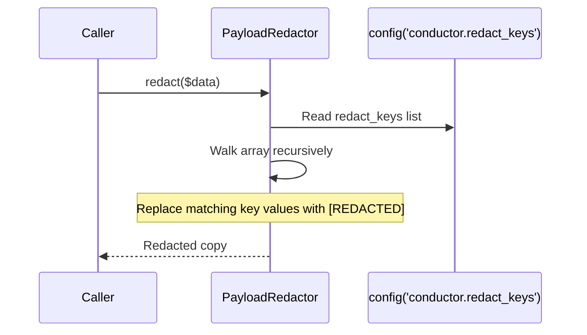
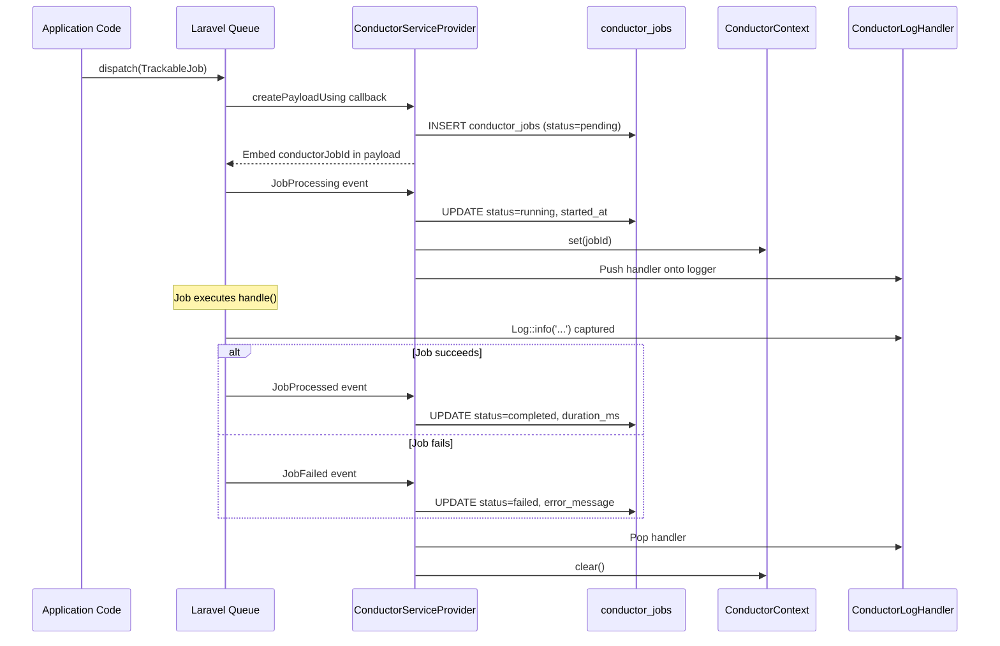

# Phase 3: Job Tracking & Log Capture

I have created the following plan after thorough exploration and analysis of the codebase. Follow the below plan verbatim. Trust the files and references. Do not re-verify what's written in the plan. Explore only when absolutely necessary. First implement all the proposed file changes and then I'll review all the changes together at the end.

## Observations

Phase 1 established the Conductor package foundation: config, service provider, facade with auth gate, authorization middleware, route groups, and Blade shell. Phase 2 created the complete data layer: 9 enums, 11 migrations, 11 models with relationships/casts/scopes, and 11 factories. The `ConductorJob` model has `JobStatus` enum-backed status, `tags`/`payload` as array casts, scopes for filtering by status/queue, and a `logs()` HasMany relationship to `ConductorJobLog`. The `ConductorJobLog` model stores per-line log entries with a `LogLevel` enum and `logged_at` timestamp. The config includes `redact_keys` for payload masking.

## Approach

Phase 3 implements the core job tracking mechanism — the system that transforms ordinary Laravel `ShouldQueue` jobs into Conductor-tracked jobs with status lifecycle, log capture, payload redaction, retry, and cooperative cancellation. The central piece is the `Trackable` trait, which hooks into Laravel's queue lifecycle events to record job status transitions. Log capture uses a custom Monolog handler (`ConductorLogHandler`) that is pushed onto the logging stack for the duration of a tracked job, attributing log lines to the correct job via a static context holder (`ConductorContext`). A `PayloadRedactor` service masks sensitive keys before payloads and logs are persisted. The trait approach ensures zero coupling — developers add `use Trackable` to existing jobs without changing dispatch or queue configuration.

---

## - [x] 1. PayloadRedactor Service

**`src/Services/PayloadRedactor.php`**

A stateless service that recursively masks values for keys matching the configured `redact_keys` list.

**Method:**

- `redact(array $data): array` — Recursively walks the given array. For each key that matches any entry in `config('conductor.redact_keys')` (case-insensitive comparison), replaces the value with the string `'[REDACTED]'`. Nested arrays and objects (cast to arrays) are walked recursively. Returns the redacted copy without modifying the original.

The class is `final`. No constructor dependencies — reads config directly.

---

## - [x] 2. ConductorContext Static Holder

**`src/Support/ConductorContext.php`**

A simple static class that holds the current tracked job's database ID within the running process. This is the same pattern Laravel Telescope uses for `ExceptionContext` — a process-scoped static variable that concurrent worker processes each maintain independently.

**Properties:**

| Property | Type | Default |
|---|---|---|
| `$currentJobId` | `protected static ?int` | `null` |

**Methods:**

- `set(int $jobId): void` — Sets the current job ID.
- `get(): ?int` — Returns the current job ID or `null`.
- `clear(): void` — Resets the current job ID to `null`.
- `isActive(): bool` — Returns `true` if a job ID is currently set.

All methods are `public static`. The class is `final`.

---

## - [x] 3. ConductorLogHandler (Monolog Handler)

**`src/Logging/ConductorLogHandler.php`**

A custom Monolog handler that captures log output from within a tracked job and persists it to the `conductor_job_logs` table. The handler extends `Monolog\Handler\AbstractProcessingHandler`.

**Constructor:**

- Accepts `$level` parameter (default `Monolog\Level::Debug`) and `$bubble` parameter (default `true`).

**`write(LogRecord $record): void`:**

1. Check `ConductorContext::isActive()`. If no active context, return immediately (this handler is a no-op outside tracked jobs).
2. Read the current job ID from `ConductorContext::get()`.
3. Map the Monolog log level to the `LogLevel` enum: `DEBUG` → `Debug`, `INFO` → `Info`, `WARNING` → `Warning`, `ERROR`/`CRITICAL`/`ALERT`/`EMERGENCY` → `Error`.
4. Create a `ConductorJobLog` record with `job_id`, `level`, `message` (from `$record->message`), and `logged_at` (from `$record->datetime`).

The handler uses `PayloadRedactor` to redact the log message if it contains any structured data from `$record->context` — specifically, the redactor runs on `$record->context` and the resulting array is JSON-encoded and appended to the message only if context is non-empty.

---

## - [x] 4. Trackable Trait

**`src/Concerns/Trackable.php`**

The core trait that developers add to their `ShouldQueue` jobs to enable Conductor tracking. The trait hooks into the job's lifecycle by leveraging Laravel's `Queue::before()`, `Queue::after()`, and `Queue::failing()` event callbacks, registered from the service provider. The trait itself provides helper methods and configuration.

**Properties added to the using class:**

| Property | Type | Default | Purpose |
|---|---|---|---|
| `$conductorJobId` | `public ?int` | `null` | The `conductor_jobs.id` for this tracked run |
| `$conductorTags` | `public array` | `[]` | Tags for filtering in the dashboard |
| `$conductorCancellable` | `public bool` | `false` | Whether this job supports cooperative cancellation |

**Methods:**

- `conductorTags(): array` — Returns `$this->conductorTags`. Override in the job class to provide dynamic tags.
- `displayName(): string` — Returns the short class name (via `class_basename(static::class)`). Override in the job class for a custom label.
- `shouldCancelConductorJob(): bool` — Queries the `conductor_jobs` record for this job. Returns `true` if the status is `CancellationRequested`. This is the "checkpoint" method jobs call periodically during long-running operations to support cooperative cancellation.
- `markAsCancellable(): void` — Updates the `conductor_jobs` record to set `cancellable_at` to `now()`. Sets `$this->conductorCancellable` to `true`. Called by the job within its `handle()` method once it reaches a point where it can safely respond to cancellation.

**Lifecycle integration (via service provider event listeners — see section 5):**

The trait does NOT directly register listeners. Instead, the service provider registers queue event listeners that detect whether a job uses the `Trackable` trait and act accordingly.

---

## - [x] 5. Queue Event Listeners (Service Provider Integration)

**Update `src/ConductorServiceProvider.php`** — In `packageBooted()`, register three queue event listeners using `Queue::before()`, `Queue::after()`, and `Queue::failing()`.

### `Queue::creating()` or dispatch-time hook

Conductor needs to create the `conductor_jobs` record at dispatch time, not when the job starts running. This is achieved by a `ConductorJobCreating` listener called from the `Trackable` trait's boot mechanism.

**Alternative approach (simpler):** Override the `Trackable` trait to hook into `__serialize()` or use a `Dispatchable` override. However, the cleanest approach is to listen for `Illuminate\Queue\Events\JobQueued` (available in Laravel 11+):

**`Queue::createPayloadUsing()` hook** — Register a callback via `Queue::createPayloadUsing()` in the service provider's `packageBooted()`. This callback fires when any job payload is being created. It checks if the job uses the `Trackable` trait. If yes:

1. Create a `ConductorJob` record with:
   - `uuid` → `Str::uuid()->toString()`
   - `class` → fully qualified class name of the job
   - `display_name` → result of `$job->displayName()`
   - `status` → `JobStatus::Pending`
   - `queue` → the queue the job is being dispatched to
   - `connection` → the connection being used
   - `tags` → result of `$job->conductorTags()`, redacted via `PayloadRedactor`
  - `payload` → a JSON envelope with `display` containing the redacted job payload for persistence/API use and `retry` containing an encrypted serialized payload string reserved for manual retry.
   - `max_attempts` → `$job->tries ?? null`
2. Set `$job->conductorJobId` to the created record's `id`.
3. Return the `conductorJobId` in the payload data so it survives serialization.

**Retry payload note:** The `retry` value is internal-only. API resources and dashboard responses expose only `payload['display']`, while `JobRetryService` uses `payload['retry']` to reconstruct the original queued job.

### `Queue::before()` — Job Starting

Listener receives `Illuminate\Queue\Events\JobProcessing`. Extracts the `conductorJobId` from the job payload. If present:

1. Update the `ConductorJob` record: set `status` → `Running`, `started_at` → `now()`, increment `attempts`.
2. Call `ConductorContext::set($conductorJobId)`.
3. Push `ConductorLogHandler` onto the current logging channel: `Log::getLogger()->pushHandler(new ConductorLogHandler())`.

### `Queue::after()` — Job Completed

Listener receives `Illuminate\Queue\Events\JobProcessed`. Extracts the `conductorJobId`. If present:

1. Update the `ConductorJob` record: set `status` → `Completed`, `completed_at` → `now()`, calculate `duration_ms` from `started_at` to `now()`.
2. Pop the `ConductorLogHandler` from the logger.
3. Call `ConductorContext::clear()`.

### `Queue::failing()` — Job Failed

Listener receives `Illuminate\Queue\Events\JobFailed`. Extracts the `conductorJobId`. If present:

1. Update the `ConductorJob` record: set `status` → `Failed`, `failed_at` → `now()`, `error_message` → `$event->exception->getMessage()`, `stack_trace` → `$event->exception->getTraceAsString()`, calculate `duration_ms`.
2. Pop the `ConductorLogHandler` from the logger.
3. Call `ConductorContext::clear()`.

---

## - [x] 6. Job Retry Service

**`src/Services/JobRetryService.php`**

Handles manual retry from the dashboard and provides the retry logic.

**Method:**

- `retry(ConductorJob $job): void`
  1. Validate that the job's status is `Failed`. If not, throw an `InvalidArgumentException`.
  2. Read the encrypted retry payload from `$job->payload['retry']`, decrypt it, and deserialize the original job from that value.
  3. Update the `ConductorJob` record: set `status` → `Pending`, clear `failed_at`, `error_message`, `stack_trace`, `completed_at`, `cancelled_at`, `duration_ms`. Increment `attempts`.
  4. Re-dispatch the deserialized job to its original queue/connection.
  5. Do NOT create a new `conductor_jobs` record — the same record is reused, preserving failure history in the logs.

**Note on manual retry vs max_attempts:** Manual retry always proceeds regardless of `max_attempts`. The retry bypasses Laravel's built-in retry limit by dispatching a fresh queue job. The `attempts` counter on the `conductor_jobs` record is incremented for tracking.

**Redaction boundary:** Any user-facing API resource, export, or dashboard view must expose only the redacted `display` payload. The encrypted retry payload is never returned outside the application boundary.

The class is `final`.

---

## - [x] 7. Job Cancellation Service

**`src/Services/JobCancellationService.php`**

Handles cancellation requests from the dashboard.

**Method:**

- `cancel(ConductorJob $job): void`
  1. If status is `Pending`: update `status` → `Cancelled`, set `cancelled_at` → `now()`. Attempt to delete the job from the queue if the queue driver supports it (best-effort).
  2. If status is `Running` and `cancellable_at` is not null: update `status` → `CancellationRequested`, set `cancellation_requested_at` → `now()`. The running job will check `shouldCancelConductorJob()` at its next checkpoint and exit cleanly, then the `Queue::after()` listener will set the final `Cancelled` status.
  3. If status is `Running` and `cancellable_at` is null: throw a `LogicException` — the job does not support cooperative cancellation.
  4. If status is terminal: throw an `InvalidArgumentException` — terminal jobs cannot be cancelled.

**Cooperative cancellation completion:** When a job that received a cancellation request finishes its current checkpoint and calls `shouldCancelConductorJob()`, it should throw a `HotReloadStudios\Conductor\Exceptions\JobCancelledException` (or return a specific signal). The `Queue::after()` listener then sets the final status to `Cancelled` instead of `Completed`.

The class is `final`.

---

## - [x] 8. JobCancelledException

**`src/Exceptions/JobCancelledException.php`**

A simple exception class extending `RuntimeException`. Used by jobs that detect cancellation via `shouldCancelConductorJob()` and need to cleanly abort. The `Queue::failing()` listener checks for this exception type and sets the job status to `Cancelled` instead of `Failed`.

---

## - [x] 9. Service Provider Bindings

**Update `src/ConductorServiceProvider.php`** — In `packageRegistered()`, add singleton bindings:

- `PayloadRedactor::class` → singleton
- `JobRetryService::class` → singleton
- `JobCancellationService::class` → singleton

In `packageBooted()`, register the queue event listeners described in section 5.

---

## - [x] 10. Tests

### Unit Tests

**`tests/Unit/Services/PayloadRedactorTest.php`**
- `it redacts values for configured keys` — Pass an array with `password` and `token` keys, assert values are `[REDACTED]`.
- `it redacts nested keys recursively` — Pass a nested array with a `secret` key two levels deep, assert it is redacted.
- `it preserves non-sensitive keys` — Pass an array with `name` and `email`, assert values are unchanged.
- `it is case-insensitive for key matching` — Pass `PASSWORD` and `Token`, assert both are redacted.
- `it handles empty arrays` — Pass `[]`, assert `[]` returned.

**`tests/Unit/Support/ConductorContextTest.php`**
- `it starts with no active context` — Assert `isActive()` returns `false` and `get()` returns `null`.
- `it sets and gets the current job id` — Call `set(42)`, assert `get()` returns `42` and `isActive()` is `true`.
- `it clears the context` — Set a job ID then clear, assert `get()` returns `null`.

**`tests/Unit/Concerns/TrackableTest.php`**
- `it provides a default display name from class basename` — Create a mock job using the trait, assert `displayName()` returns the short class name.
- `it returns empty tags by default` — Assert `conductorTags()` returns `[]`.

### Feature Tests

**`tests/Feature/JobTrackingTest.php`**
- `it creates a conductor_jobs record when a trackable job is dispatched` — Dispatch a test job using `Trackable`, assert a `conductor_jobs` row exists with status `Pending`.
- `it updates status to running when job starts processing` — Dispatch and process via `Queue::fake()` then process the job. Assert status transitions to `Running`.
- `it updates status to completed when job finishes` — Dispatch and fully process a trackable job. Assert status is `Completed`, `completed_at` is set, and `duration_ms` is populated.
- `it updates status to failed when job throws` — Dispatch a trackable job that throws. Assert status is `Failed`, `error_message` and `stack_trace` are populated.
- `it captures log output during job execution` — Dispatch a trackable job that calls `Log::info('test message')`. Assert a `conductor_job_logs` row exists with the message and correct job_id.
- `it redacts sensitive keys in payload` — Dispatch a trackable job with `'password'` in constructed data. Assert the stored payload has `[REDACTED]` for the password value.
- `it stores tags from conductorTags method` — Dispatch a trackable job that overrides `conductorTags()` to return `['billing', 'invoice']`. Assert the tags are stored.
- `it preserves conductor job id across serialization` — Dispatch a trackable job, deserialize the payload, assert `conductorJobId` is present.

**`tests/Feature/JobRetryTest.php`**
- `it retries a failed job` — Create a failed `ConductorJob`, call `JobRetryService::retry()`. Assert status resets to `Pending` and attempts is incremented.
- `it rejects retry on a non-failed job` — Attempt to retry a `Completed` job. Assert `InvalidArgumentException` is thrown.

**`tests/Feature/JobCancellationTest.php`**
- `it cancels a pending job` — Create a pending `ConductorJob`, call `cancel()`. Assert status is `Cancelled` and `cancelled_at` is set.
- `it requests cancellation for a running cancellable job` — Create a running job with `cancellable_at` set, call `cancel()`. Assert status is `CancellationRequested`.
- `it rejects cancellation for a running non-cancellable job` — Create a running job without `cancellable_at`, call `cancel()`. Assert `LogicException` is thrown.
- `it rejects cancellation for a terminal job` — Create a completed job, call `cancel()`. Assert `InvalidArgumentException` is thrown.
