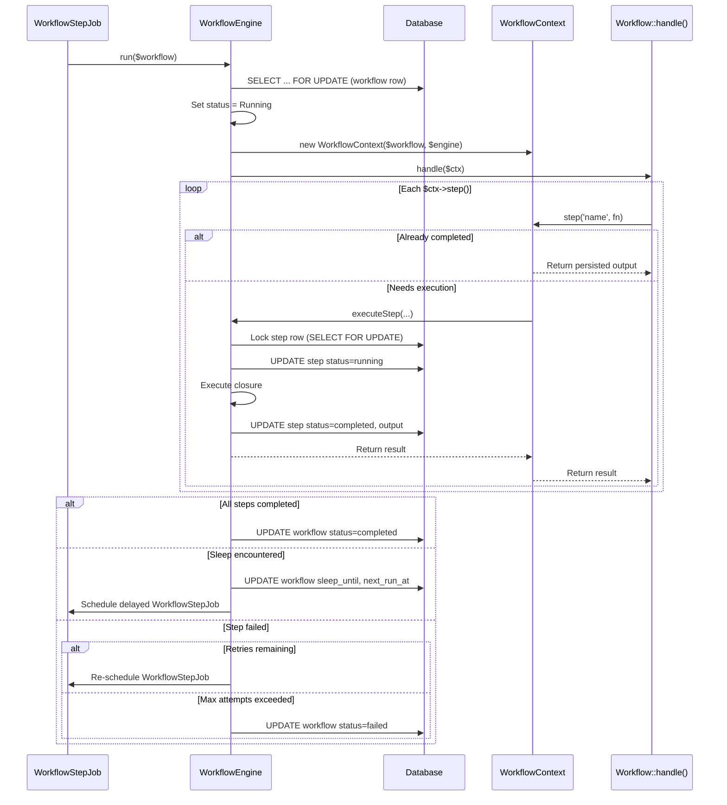

# Phase 4: Durable Workflow Engine

I have created the following plan after thorough exploration and analysis of the codebase. Follow the below plan verbatim. Trust the files and references. Do not re-verify what's written in the plan. Explore only when absolutely necessary. First implement all the proposed file changes and then I'll review all the changes together at the end.

## Observations

Phase 1 established the package foundation. Phase 2 created the full data layer including `ConductorWorkflow` (with `WorkflowStatus` enum, `current_step_index`, `next_run_at`, `sleep_until`, `waiting_for_event`), `ConductorWorkflowStep` (with `StepStatus` enum and `available_at`), and their factories. Phase 3 implemented the job tracking system: `Trackable` trait, `ConductorContext`, `ConductorLogHandler`, `PayloadRedactor`, queue event listeners, retry and cancellation services. The `ConductorWorkflowStep` has a nullable `conductor_job_id` FK to `ConductorJob`, and the `ConductorWorkflow` model has a `runnable()` scope that filters for workflows ready for continuation.

## Approach

Phase 4 builds the durable workflow engine — the system that executes multi-step workflows with per-step persistence, automatic retry, sleep/delay, and pessimistic locking for concurrent execution safety. The architecture consists of four pieces: (1) `Workflow` is the abstract base class developers extend to define workflows; (2) `WorkflowContext` provides the `step()` and `sleep()` API; (3) `WorkflowEngine` is the service that orchestrates step execution with database locking; (4) `WorkflowStepJob` is the queue job that drives workflow progression. Each step's result is committed to the database atomically before the next step is dispatched. The pessimistic lock (`SELECT ... FOR UPDATE`) on the workflow row prevents duplicate step execution when multiple queue workers pick up the same continuation.

---

## - [x] 1. Workflow Base Class

**`src/Workflow.php`**

An abstract class that developers extend to define multi-step workflows. Analogous to how Laravel jobs implement `ShouldQueue`, workflows extend `Workflow`.

**Properties:**

| Property | Visibility | Type | Default | Purpose |
|---|---|---|---|---|
| `$stepMaxAttempts` | `public` | `int` | `3` | Max retry attempts per step |
| `$conductorWorkflowId` | `public` | `?int` | `null` | Populated at dispatch time with the `conductor_workflows.id` |

**Abstract method:**

- `handle(WorkflowContext $ctx): void` — The developer defines their workflow steps here.

**Concrete methods:**

- `displayName(): string` — Returns `class_basename(static::class)`. Override for a custom dashboard label.
- `static dispatch(...$args): PendingWorkflowDispatch` — Creates a new `PendingWorkflowDispatch` instance (see section 5). Accepts the same constructor arguments the workflow class expects.

The class is NOT `final` — it is `abstract` and intended for extension. It should NOT use the `Trackable` trait (workflows track steps, not the workflow itself as a single job).

---

## - [x] 2. WorkflowContext

**`src/WorkflowContext.php`**

Provides the fluent API (`$ctx->step()`, `$ctx->sleep()`) used inside `Workflow::handle()`. The context is constructed by the `WorkflowEngine` and tracks step progression.

**Constructor:**

- `__construct(private readonly ConductorWorkflow $workflow, private readonly WorkflowEngine $engine)`

**Properties:**

| Property | Visibility | Type | Default |
|---|---|---|---|
| `$stepIndex` | `private` | `int` | `0` |
| `$shouldPause` | `private` | `bool` | `false` |

**Methods:**

- `step(string $name, Closure $callback): mixed`
  1. Check if `$shouldPause` is `true`. If yes, increment `$stepIndex` and return `null` — the workflow is paused (sleeping) and skips step execution until the engine re-enters at the correct index.
  2. Query `ConductorWorkflowStep` for `(workflow_id, step_index)`.
  3. If the step exists and status is `Completed`: increment `$stepIndex`, return the persisted `output` — this is the "replay" path for already-completed steps on resume.
  4. If the step exists and status is `Skipped`: increment `$stepIndex`, return `null`.
  5. Otherwise, delegate to `$this->engine->executeStep($this->workflow, $this->stepIndex, $name, $callback)`.
  6. Increment `$stepIndex`.
  7. Return the step result.

- `sleep(string|int $duration): void`
  1. Calculate the wake-up timestamp: if `$duration` is a string (e.g. `'3 days'`), parse via `Carbon::parse($duration)` relative to now. If an integer, treat as seconds.
  2. Check if the workflow's `sleep_until` has already passed (i.e., we are resuming after a sleep). If `sleep_until` is set and is in the past, clear `sleep_until` on the workflow and return — the sleep is done, proceed to the next step.
  3. If the sleep is new (either `sleep_until` is null or in the future): update the workflow record with `sleep_until` → the calculated timestamp and `next_run_at` → the same timestamp. Set `$shouldPause` to `true`. The current invocation of `handle()` will skip all subsequent `step()` calls. The `WorkflowEngine` will detect the pause and schedule a delayed `WorkflowStepJob`.

The class is `final`.

---

## - [x] 3. WorkflowEngine Service

**`src/Services/WorkflowEngine.php`**

The central orchestrator for workflow execution. Called by `WorkflowStepJob` to progress a workflow.

**Methods:**

### `run(ConductorWorkflow $workflow): void`

The main entry point. Called when a workflow needs to progress (either freshly dispatched or resumed after delay/failure).

1. Acquire a pessimistic lock on the `conductor_workflows` row using `DB::transaction()` with `ConductorWorkflow::where('id', $workflow->id)->lockForUpdate()->first()`.
2. If the lock cannot be acquired (row not found or already locked), release the job back to the queue (throw a `Illuminate\Queue\Exceptions\ManuallyFailedException` or use `$this->release()` — see section 4 for how the job handles this).
3. Verify the workflow status is `Pending` or `Running`. If terminal, return (no-op).
4. If status is `Pending`, update to `Running`.
5. Construct a `WorkflowContext($workflow, $this)`.
6. Instantiate the workflow class from `$workflow->class` with the deserialized constructor arguments from `$workflow->input`.
7. Call `$workflowInstance->handle($ctx)` inside a try-catch.
8. If `handle()` completes without the context pausing: update workflow `status` → `Completed`, set `completed_at` → `now()`, store `output` if the last step returned a value.
9. If the context paused (sleep): schedule a `WorkflowStepJob` delayed until `next_run_at`.
10. If an exception is thrown: check if the current step has exceeded `$stepMaxAttempts`. If yes, update workflow `status` → `Failed`. If not, increment the step's `attempts` and re-schedule the `WorkflowStepJob` with backoff.

### `executeStep(ConductorWorkflow $workflow, int $stepIndex, string $name, Closure $callback): mixed`

Called by `WorkflowContext::step()` for steps that need execution (not replayed).

1. Inside the existing database transaction (inherited from `run()`), acquire a lock on the `conductor_workflow_steps` row for `(workflow_id, step_index)`. If the row does not exist, create it with status `Pending`.
2. If the step row already exists with a terminal status, return its stored output (race condition guard).
3. Update step status to `Running`, set `started_at` → `now()`, increment `attempts`.
4. Update the workflow's `current_step_index` to `$stepIndex`.
5. Execute the closure: `$result = $callback()`.
6. On success: update step status to `Completed`, store `output` (JSON-serialized result), set `completed_at` → `now()`, calculate `duration_ms`.
7. On failure (exception): update step status to `Failed`, store `error_message` and `stack_trace`. Re-throw the exception to be caught by `run()`.

The class is `final`.

---

## - [x] 4. WorkflowStepJob

**`src/Jobs/WorkflowStepJob.php`**

A standard Laravel `ShouldQueue` job that drives workflow progression. Each dispatch represents one attempt to progress the workflow from its current state.

**Constructor:**

- `__construct(public readonly int $workflowId)`

**Properties:**

| Property | Value | Purpose |
|---|---|---|
| `$queue` | `config('conductor.queue.queue')` | Use Conductor's dedicated queue |
| `$connection` | `config('conductor.queue.connection')` | Use Conductor's queue connection |
| `$tries` | `1` | Retries are managed by the WorkflowEngine, not Laravel's queue |
| `$maxExceptions` | `1` | Same — engine handles retry logic |

**`handle(WorkflowEngine $engine): void`:**

1. Load the `ConductorWorkflow` by `$this->workflowId`.
2. If not found or in a terminal state, return (no-op — workflow may have been cancelled).
3. Call `$engine->run($workflow)`.

**`failed(Throwable $e): void`:**

1. Load the `ConductorWorkflow` by `$this->workflowId`.
2. If found and not terminal, update status to `Failed`.
3. Log the failure to Conductor's error log.

This job does NOT use the `Trackable` trait — its execution is tracked indirectly through the `ConductorWorkflow` and `ConductorWorkflowStep` records. Individual workflow steps may optionally create `ConductorJob` records (linked via `conductor_job_id`) if sub-jobs are dispatched within a step.

---

## - [x] 5. PendingWorkflowDispatch

**`src/PendingWorkflowDispatch.php`**

Returned by `Workflow::dispatch()`. Provides a fluent API for configuring the dispatch before it executes, similar to `PendingDispatch` for standard jobs.

**Constructor:**

- `__construct(private readonly string $workflowClass, private readonly array $arguments)`

**Methods:**

- `onQueue(string $queue): static` — Sets the queue.
- `onConnection(string $connection): static` — Sets the connection.
- `delay(DateTimeInterface|int $delay): static` — Sets the initial delay.
- `dispatch(): ConductorWorkflow` — Actually creates the records and dispatches:
  1. Create a `ConductorWorkflow` record with `uuid` → `Str::uuid()->toString()`, `class` → `$workflowClass`, `display_name` → result of calling `displayName()` on a temporary instance, `status` → `Pending`, `input` → serialized `$arguments`.
  2. Dispatch a `WorkflowStepJob` with the workflow's `id`, using the configured queue/connection/delay.
  3. Return the created `ConductorWorkflow` model.

**Destructor:**

- `__destruct()` — If not already dispatched, calls `dispatch()`. This mirrors Laravel's `PendingDispatch` behavior where the dispatch happens automatically when the pending object goes out of scope.

The class is `final`.

---

## - [x] 6. Workflow Cancellation

**`src/Services/WorkflowCancellationService.php`**

Handles workflow cancellation requests from the dashboard.

**Method:**

- `cancel(ConductorWorkflow $workflow): void`
  1. If the workflow status is terminal, throw `InvalidArgumentException`.
  2. Update the workflow status to `Cancelled`, set `cancelled_at` → `now()`.
  3. Query all `ConductorWorkflowStep` records for this workflow where status is `Pending`. Update them to `Skipped`.
  4. If the currently running step has a linked `ConductorJob` with `Trackable`, delegate to `JobCancellationService` (from Phase 3) to request cooperative cancellation on that job.

The class is `final`.

---

## - [x] 7. Service Provider Bindings

**Update `src/ConductorServiceProvider.php`:**

In `packageRegistered()`, add singleton bindings:
- `WorkflowEngine::class`
- `WorkflowCancellationService::class`

---

## - [x] 8. Tests

### Unit Tests

**`tests/Unit/WorkflowContextTest.php`**
- `it replays completed steps without re-executing` — Create a workflow with a completed step at index 0. Call `$ctx->step()` for that index. Assert the closure was NOT executed and the persisted output was returned.
- `it skips steps after sleep` — Call `$ctx->sleep('1 hour')` then `$ctx->step()`. Assert the step closure was not executed.
- `it increments step index on each step call` — Call `$ctx->step()` three times. Assert internal step index reaches 3.

**`tests/Unit/PendingWorkflowDispatchTest.php`**
- `it stores queue and connection configuration` — Call `onQueue('high')` and `onConnection('redis')`. Assert the configured values are passed through at dispatch.

### Feature Tests

**`tests/Feature/WorkflowDispatchTest.php`**
- `it creates a conductor_workflows record on dispatch` — Dispatch a test workflow. Assert a `conductor_workflows` row exists with status `Pending` and the correct class name.
- `it dispatches a WorkflowStepJob` — Dispatch a test workflow. Assert `WorkflowStepJob` was pushed to the queue (use `Queue::fake()`).
- `it stores serialized constructor arguments as input` — Dispatch a workflow with constructor args. Assert `input` on the record matches the serialized args.

**`tests/Feature/WorkflowExecutionTest.php`**
- `it executes all steps in sequence` — Create a workflow with 3 steps. Process the `WorkflowStepJob`. Assert all 3 step records are `Completed` and the workflow status is `Completed`.
- `it persists step output and replays on resume` — Create a workflow with 2 steps where step 0 is already completed. Process the job. Assert step 0 was not re-executed (no new log entry), step 1 was executed, and the workflow is `Completed`.
- `it retries a failed step up to stepMaxAttempts` — Create a workflow with a step that fails on first attempt then succeeds. Process twice. Assert the step's `attempts` is 2 and status is `Completed`.
- `it marks workflow as failed when step exceeds max attempts` — Create a workflow where a step always fails. Process `$stepMaxAttempts` times. Assert the workflow status is `Failed`.
- `it handles sleep by scheduling a delayed continuation` — Create a workflow with a sleep between steps. Process once. Assert `sleep_until` and `next_run_at` are set on the workflow, and a delayed `WorkflowStepJob` was dispatched.
- `it resumes after sleep completes` — Create a workflow with `sleep_until` in the past. Process. Assert the step after the sleep executes and the workflow completes.
- `it acquires pessimistic lock and prevents duplicate execution` — (Database-specific test) Start two concurrent `WorkflowEngine::run()` calls. Assert only one acquires the lock and progresses the workflow.

**`tests/Feature/WorkflowCancellationTest.php`**
- `it cancels a pending workflow` — Create a pending workflow with 3 pending steps. Cancel. Assert workflow status is `Cancelled`, all steps are `Skipped`.
- `it cancels a running workflow and skips remaining steps` — Create a running workflow with step 0 `Completed`, step 1 `Running`, step 2 `Pending`. Cancel. Assert workflow is `Cancelled`, step 2 is `Skipped`, step 1 remains `Running` (it will finish its current execution).
- `it rejects cancellation of a terminal workflow` — Attempt to cancel a `Completed` workflow. Assert `InvalidArgumentException`.

---

## - [x] 9. Test Workflow Fixture

Create a test helper workflow class used by the feature tests:

**`tests/Fixtures/TestWorkflow.php`**

A concrete `Workflow` subclass with configurable step behavior (accepts closures or step definitions via constructor). This avoids duplicating workflow definitions across test files.
