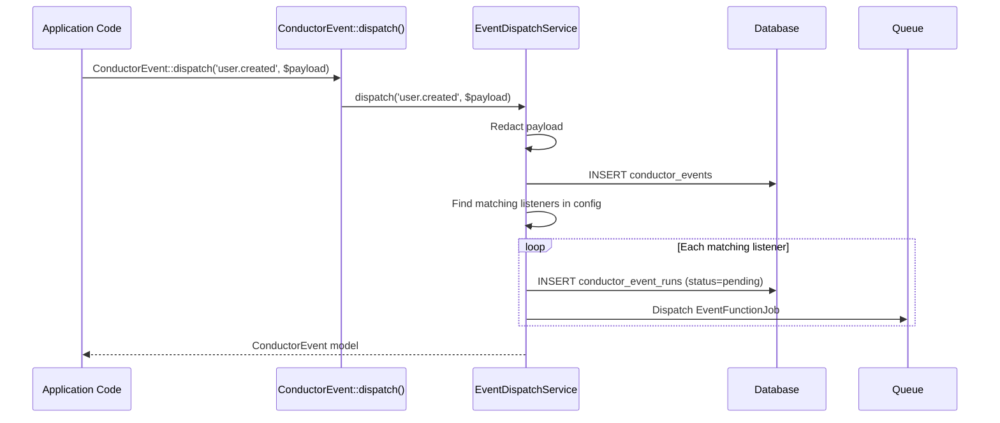
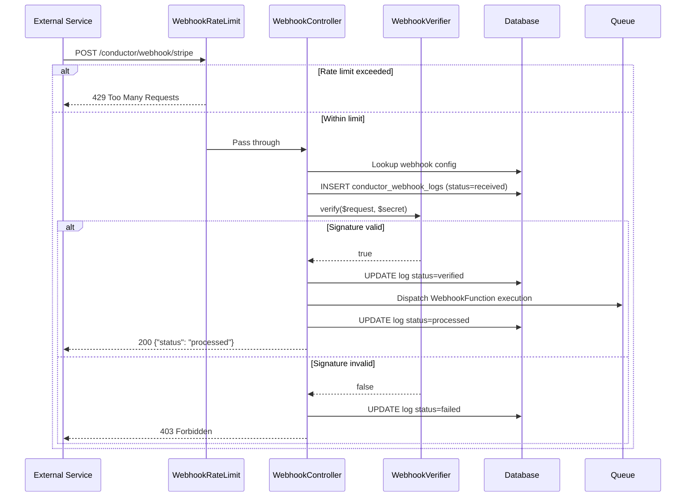

# Phase 5: Event Bus, Scheduled Functions & Webhooks

I have created the following plan after thorough exploration and analysis of the codebase. Follow the below plan verbatim. Trust the files and references. Do not re-verify what's written in the plan. Explore only when absolutely necessary. First implement all the proposed file changes and then I'll review all the changes together at the end.

## Observations

Phase 1 established the package foundation with config (including `functions`, `webhooks`, and `webhook_rate_limit` keys), service provider, route groups (API and webhook stubs). Phase 2 created the data layer: `ConductorEvent` model with `runs()` HasMany, `ConductorEventRun` model with `EventRunStatus` enum, `ConductorSchedule` model with `is_active` scope and `ScheduleRunStatus`, `ConductorWebhookSource` and `ConductorWebhookLog` models with `WebhookLogStatus` enum. Phase 3 implemented job tracking with the `Trackable` trait, queue event listeners, and `PayloadRedactor`. Phase 4 built the workflow engine. The config `functions` key is an array of class names; the `webhooks` key is an associative array keyed by source name with `secret` and `function` sub-keys.

## Approach

Phase 5 implements three related feature systems that share the pattern of "registered PHP classes triggered by external signals." Event functions listen to named events, scheduled functions execute on cron expressions, and webhook functions respond to HTTP POST requests. All three use explicit registration in `config/conductor.php` — no auto-discovery. The service provider iterates the `functions` config to classify and register each function type. Event dispatch creates a `ConductorEvent` record and dispatches listener jobs. Scheduled functions are registered into Laravel's scheduler. Webhook functions are bound to routes with HMAC signature verification and rate limiting.

---

## - [ ] 1. EventFunction Base Class

**`src/EventFunction.php`**

An abstract class that developers extend to define event-driven functions.

**Abstract methods:**

- `listenTo(): string` — Returns the dot-notation event name this function listens to (e.g. `'user.created'`).
- `handle(array $payload): void` — Executes the function logic with the event payload.

**Concrete methods:**

- `displayName(): string` — Returns `class_basename(static::class)`. Override for a custom label.

The class is NOT `final` — it is `abstract` and intended for extension.

---

## - [ ] 2. Event Dispatch Service

**`src/Services/EventDispatchService.php`**

Handles dispatching named events through Conductor's event bus.

**Method:**

- `dispatch(string $eventName, array $payload = []): ConductorEvent`
  1. Redact the payload via `PayloadRedactor::redact($payload)`.
  2. Create a `ConductorEvent` record with `uuid` → `Str::uuid()->toString()`, `name` → `$eventName`, `payload` → redacted payload, `dispatched_at` → `now()`.
  3. Resolve registered listener functions: iterate `config('conductor.functions')`, instantiate each class, check if it is an `EventFunction` subclass and if `listenTo()` matches `$eventName`.
  4. For each matching listener:
     a. Create a `ConductorEventRun` record with `event_id`, `function_class`, `status` → `Pending`.
     b. Dispatch an `EventFunctionJob` (see section 3) with the event run ID, the function class, and the payload.
  5. Return the created `ConductorEvent` model.

**Static convenience method on `ConductorEvent` model:**

Add a static `dispatch(string $name, array $payload = []): ConductorEvent` method on the `ConductorEvent` model that resolves `EventDispatchService` from the container and delegates to it. This provides the API surface described in the PRD: `ConductorEvent::dispatch('user.created', [...])`.

**Update `src/Models/ConductorEvent.php`** — Add the static `dispatch()` method.

The class is `final`.

---

## - [ ] 3. EventFunctionJob

**`src/Jobs/EventFunctionJob.php`**

A `ShouldQueue` job that executes a single event function for a specific event.

**Constructor:**

- `__construct(public readonly int $eventRunId, public readonly string $functionClass, public readonly array $payload)`

**Properties:**

| Property | Value |
|---|---|
| `$queue` | `config('conductor.queue.queue')` |
| `$connection` | `config('conductor.queue.connection')` |
| `$tries` | `3` |
| `$backoff` | `[5, 30, 60]` |

**`handle(): void`:**

1. Load the `ConductorEventRun` by `$this->eventRunId`. If not found, return.
2. Update the event run: `status` → `Running`, `started_at` → `now()`, increment `attempts`.
3. Instantiate the function class: `$function = new $this->functionClass()`.
4. Call `$function->handle($this->payload)`.
5. On success: update the event run `status` → `Completed`, `completed_at` → `now()`, calculate `duration_ms`.
6. On failure: update the event run `status` → `Failed` if no more retries, set `error_message`.

**`failed(Throwable $e): void`:**

1. Update the event run: `status` → `Failed`, `error_message` → `$e->getMessage()`.

---

## - [ ] 4. ScheduledFunction Base Class

**`src/ScheduledFunction.php`**

An abstract class that developers extend to define cron-scheduled functions.

**Abstract methods:**

- `schedule(): string` — Returns a cron expression (e.g. `'0 9 * * *'`) or a named frequency string (`'daily'`, `'hourly'`, `'weekly'`, `'monthly'`, `'yearly'`, `'everyMinute'`, `'everyFiveMinutes'`, `'everyTenMinutes'`, `'everyFifteenMinutes'`, `'everyThirtyMinutes'`).
- `handle(): void` — Executes the scheduled logic.

**Concrete methods:**

- `displayName(): string` — Returns `class_basename(static::class)`.

The class is NOT `final` — `abstract`.

---

## - [ ] 5. Schedule Registration

**`src/Services/ScheduleRegistrar.php`**

Called from the service provider to register scheduled functions into Laravel's scheduler.

**Method:**

- `register(Schedule $schedule): void`

  1. Iterate `config('conductor.functions')`.
  2. For each class, check if it is a subclass of `ScheduledFunction`.
  3. For each scheduled function:
     a. Ensure a `ConductorSchedule` record exists for this `function_class` (upsert by `function_class`). Set `display_name` from `displayName()`, `cron_expression` from `schedule()`.
     b. Register the function into Laravel's scheduler:
        - If `schedule()` returns a cron expression (matches cron format), use `$schedule->call(...)->cron($expression)`.
        - If `schedule()` returns a named frequency, use the corresponding method (e.g. `$schedule->call(...)->daily()`).
     c. The scheduled callback:
        1. Reload the `ConductorSchedule` record.
        2. If `is_active` is `false`, skip execution.
        3. Update `last_run_at` → `now()`.
        4. Execute `$function->handle()` in a try-catch.
        5. On success: set `last_run_status` → `Completed`, calculate and set `next_run_at`.
        6. On failure: set `last_run_status` → `Failed`.

**Service Provider Integration:**

In `ConductorServiceProvider::packageBooted()`, call `$this->app->afterResolving(Schedule::class, function (Schedule $schedule) { app(ScheduleRegistrar::class)->register($schedule); })`. This ensures schedules are registered when the scheduler boots, not on every request.

The class is `final`.

---

## - [ ] 6. Schedule Toggle Service

**`src/Services/ScheduleToggleService.php`**

Handles enabling/disabling schedules from the dashboard.

**Method:**

- `toggle(ConductorSchedule $schedule): ConductorSchedule`
  1. Toggle `is_active` to its opposite value.
  2. Save the record.
  3. Return the updated model.

The class is `final`.

---

## - [ ] 7. WebhookFunction Base Class

**`src/WebhookFunction.php`**

An abstract class for webhook-triggered functions.

**Abstract methods:**

- `handle(array $payload, string $source): void` — Processes the verified webhook payload.

**Concrete methods:**

- `displayName(): string` — Returns `class_basename(static::class)`.

The class is NOT `final` — `abstract`.

---

## - [ ] 8. Webhook Signature Verification

**`src/Services/WebhookVerifier.php`**

Verifies HMAC signatures on inbound webhook requests.

**Method:**

- `verify(Request $request, string $secret): bool`
  1. Read the signature header from the request. Check `X-Signature`, `X-Hub-Signature-256`, and `X-Signature-256` headers (in order of precedence).
  2. Extract the algorithm prefix if present (e.g. `sha256=abc123` → algorithm `sha256`, signature `abc123`). Default algorithm is `sha256`.
  3. Compute the expected signature: `hash_hmac($algorithm, $request->getContent(), $secret)`.
  4. Compare using `hash_equals()` (constant-time comparison) against the provided signature.
  5. Return `true` if signatures match, `false` otherwise.

The class is `final`.

---

## - [ ] 9. Webhook Controller

**`src/Http/Controllers/WebhookController.php`**

Handles inbound webhook requests.

**`__invoke(Request $request, string $source): JsonResponse`:**

1. Look up the webhook source configuration from `config("conductor.webhooks.{$source}")`. If not found, return `404`.
2. Load or create the `ConductorWebhookSource` record for this source (upsert by `source`).
3. If `is_active` is false, return `200` with `{"status": "inactive"}`.
4. Normalize the inbound payload: use `$request->json()->all()` for JSON requests, otherwise `$request->request->all()`, and fall back to `['raw_body' => $request->getContent()]` when no structured payload is present.
5. Create a `ConductorWebhookLog` record with `source`, `payload` → redacted normalized payload (via `PayloadRedactor`), `masked_signature` → mask the signature header value (show first 8 chars + `****`), `status` → `Received`, `received_at` → `now()`.
6. Verify the signature using `WebhookVerifier::verify($request, $config['secret'])`.
7. If verification fails: update the webhook log `status` → `Failed`. Return `403`.
8. Update the webhook log `status` → `Verified`.
9. Dispatch a queued `WebhookFunctionJob` with the webhook log ID, source, function class, and normalized payload.
10. Update the webhook log `status` → `Processed`.
11. Return `200` with `{"status": "processed"}`.

**Execution model:** Webhook functions are always executed asynchronously through a queue job. The controller acknowledges receipt after verification and queue dispatch; it never executes the function inline.

**`src/Jobs/WebhookFunctionJob.php`**

A `ShouldQueue` job that executes a single webhook function for a verified webhook request.

**Constructor:**

- `__construct(public readonly int $webhookLogId, public readonly string $source, public readonly string $functionClass, public readonly array $payload)`

**Properties:**

| Property | Value |
|---|---|
| `$queue` | `config('conductor.queue.queue')` |
| `$connection` | `config('conductor.queue.connection')` |

**`handle(): void`:**

1. Load the `ConductorWebhookLog` by `$this->webhookLogId`. If not found, return.
2. Instantiate the function class and call `$function->handle($this->payload, $this->source)`.
3. If the function throws, update the webhook log `status` → `Failed` and re-throw so normal queue retry semantics apply.

The class is `final`.

---

## - [ ] 10. Webhook Rate Limiting

**`src/Http/Middleware/WebhookRateLimit.php`**

Middleware applied to webhook routes that enforces per-source-IP rate limiting.

**`handle(Request $request, Closure $next): Response`:**

1. Read `config('conductor.webhook_rate_limit')`. If `null`, skip rate limiting and pass through.
2. Use Laravel's `RateLimiter` to check the key `'conductor-webhook:' . $request->route('source') . ':' . $request->ip()` against the configured limit per minute.
3. If rate limit exceeded, return `429 Too Many Requests`.
4. Otherwise, proceed with `$next($request)`.

The class is `final`.

---

## - [ ] 11. Webhook Route Registration

**Update `routes/webhook.php`:**

Register the webhook route:
- `POST /{source}` → `WebhookController::class`
- Apply `WebhookRateLimit::class` middleware.

**Update `src/ConductorServiceProvider.php`:**

In the webhook route group registration (from Phase 1), add the `WebhookRateLimit` middleware to the group.

---

## - [ ] 12. Service Provider Bindings

**Update `src/ConductorServiceProvider.php`:**

In `packageRegistered()`, add singleton bindings:
- `EventDispatchService::class`
- `ScheduleRegistrar::class`
- `ScheduleToggleService::class`
- `WebhookVerifier::class`

In `packageBooted()`:
- Register the schedule hook as described in section 5.

---

## - [ ] 13. Tests

### Unit Tests

**`tests/Unit/Services/WebhookVerifierTest.php`**
- `it verifies a valid sha256 HMAC signature` — Compute a valid signature for a payload, assert `verify()` returns `true`.
- `it rejects an invalid signature` — Provide a wrong signature, assert `verify()` returns `false`.
- `it handles sha256= prefixed signatures` — Provide a signature with `sha256=` prefix, assert correct verification.
- `it checks multiple header names` — Provide the signature in `X-Hub-Signature-256`, assert it is found and verified.

**`tests/Unit/Services/ScheduleToggleServiceTest.php`**
- `it toggles an active schedule to inactive` — Create an active schedule, toggle. Assert `is_active` is `false`.
- `it toggles an inactive schedule to active` — Create an inactive schedule, toggle. Assert `is_active` is `true`.

### Feature Tests

**`tests/Feature/EventDispatchTest.php`**
- `it creates an event record when dispatched` — Register a test event function in config. Call `ConductorEvent::dispatch('test.event', ['key' => 'value'])`. Assert a `conductor_events` row exists.
- `it dispatches listener jobs for matching functions` — Register two event functions for `test.event`. Dispatch the event. Assert two `conductor_event_runs` rows are created with status `Pending`, and two `EventFunctionJob` instances are queued.
- `it does not dispatch for non-matching functions` — Register a function listening to `other.event`. Dispatch `test.event`. Assert no event runs are created for the non-matching function.
- `it redacts sensitive keys in event payload` — Dispatch with `['password' => 'secret123']`. Assert stored payload has `[REDACTED]`.

**`tests/Feature/EventFunctionJobTest.php`**
- `it executes the function and marks the run as completed` — Create an event run, process the `EventFunctionJob`. Assert status is `Completed` and `duration_ms` is set.
- `it marks the run as failed when the function throws` — Use a function that throws. Process the job. Assert status is `Failed` and `error_message` is set.

**`tests/Feature/ScheduleRegistrationTest.php`**
- `it registers scheduled functions into laravel scheduler` — Register a scheduled function in config. Boot the scheduler. Assert the schedule contains the expected cron entry.
- `it creates conductor_schedules records on registration` — Register a scheduled function. Boot. Assert a `conductor_schedules` row exists with correct `function_class` and `cron_expression`.
- `it skips execution when schedule is inactive` — Create an inactive `ConductorSchedule` record. Trigger the schedule. Assert `last_run_at` was NOT updated.
- `it updates last_run_at and last_run_status on successful execution` — Trigger a scheduled function. Assert `last_run_at` is set and `last_run_status` is `Completed`.

**`tests/Feature/WebhookIngestionTest.php`**
- `it processes a webhook with valid signature` — Configure a webhook source with a known secret. Send a POST with valid HMAC signature. Assert `200` response and a `conductor_webhook_logs` row with status `Processed`.
- `it queues a webhook function job after successful verification` — Send a valid webhook and assert a `WebhookFunctionJob` was pushed with the normalized payload and source.
- `it rejects a webhook with invalid signature` — Send a POST with wrong signature. Assert `403` response and webhook log status `Failed`.
- `it returns 404 for unconfigured webhook sources` — POST to `/conductor/webhook/unknown`. Assert `404`.
- `it rate limits webhook requests per source ip` — Set `webhook_rate_limit` to `2`. Send 3 requests to the same source from the same IP and assert the third returns `429`, then assert a different source from the same IP is still accepted.
- `it masks the signature in webhook logs` — Send a webhook with a long signature header. Assert `masked_signature` in the log shows only the first 8 chars followed by `****`.
- `it redacts sensitive keys in webhook payload` — Send a webhook with `token` in the body. Assert stored payload has `[REDACTED]`.
- `it handles inactive webhook sources` — Set `is_active` to false on the source. Send a valid webhook. Assert `200` with `"inactive"` status and no function execution.

