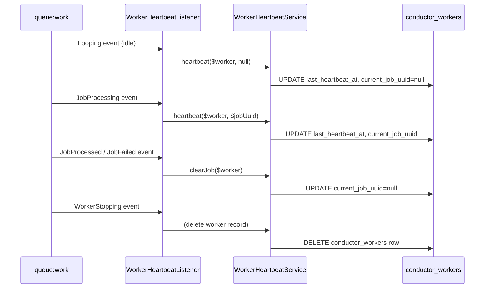

# Phase 6: Worker Heartbeats, Metrics & Artisan Commands

I have created the following plan after thorough exploration and analysis of the codebase. Follow the below plan verbatim. Trust the files and references. Do not re-verify what's written in the plan. Explore only when absolutely necessary. First implement all the proposed file changes and then I'll review all the changes together at the end.

## Observations

Phase 1 established the service provider, config (with `heartbeat_interval`, `worker_timeout`, `prune_after_days` keys), and route groups. Phase 2 created `ConductorWorker` model with `derivedStatus()` helper and `WorkerStatus` enum, `ConductorMetricSnapshot` model with `MetricType` enum, and all factories. Phase 3 implemented job tracking with queue event listeners (`Queue::before()`, `Queue::after()`, `Queue::failing()`). Phase 4 built the workflow engine. Phase 5 implemented events, schedules, and webhooks. The `ConductorWorker` model stores `worker_uuid`, `worker_name`, `queue`, `connection`, `hostname`, `process_id`, `current_job_uuid`, and `last_heartbeat_at`. Status is derived at query time, not stored.

## Approach

Phase 6 adds operational infrastructure: worker heartbeat collection via queue lifecycle hooks, periodic metric snapshot aggregation, and three Artisan commands (`conductor:publish`, `conductor:prune`, `conductor:status`). Worker heartbeats use Laravel's queue event system — the same listeners from Phase 3 are extended to update worker records. Metrics are aggregated by a scheduled command that snapshots throughput, failure rate, and queue depth. The prune command deletes old records with cascade deletes. All three commands are registered in the service provider.

---

## - [x] 1. Worker Heartbeat Service

**`src/Services/WorkerHeartbeatService.php`**

Manages worker registration and heartbeat updates.

**Methods:**

- `register(string $workerName, string $queue, string $connection): ConductorWorker`
  1. Generate a `worker_uuid` using `Str::uuid()->toString()`.
  2. Create or update (upsert by `worker_name` + `hostname` + `process_id`) a `ConductorWorker` record with `worker_uuid`, `worker_name`, `queue`, `connection`, `hostname` → `gethostname()`, `process_id` → `getmypid()`, `last_heartbeat_at` → `now()`.
  3. Return the model.

- `heartbeat(ConductorWorker $worker, ?string $currentJobUuid = null): void`
  1. Update `last_heartbeat_at` → `now()`.
  2. Update `current_job_uuid` → `$currentJobUuid` (may be `null` when idle).
  3. Save.

- `clearJob(ConductorWorker $worker): void`
  1. Update `current_job_uuid` → `null`, `last_heartbeat_at` → `now()`.
  2. Save.

The class is `final`.

---

## - [x] 2. Worker Heartbeat Event Listener

**`src/Listeners/WorkerHeartbeatListener.php`**

A listener registered in the service provider that hooks into Laravel's queue lifecycle events to maintain worker heartbeat records.

**Events listened to:**

- `Illuminate\Queue\Events\WorkerStarting` — Fired when `queue:work` starts. Not available in all Laravel versions. If available, call `WorkerHeartbeatService::register()`.
- `Illuminate\Queue\Events\Looping` — Fired on each iteration of the worker loop (between jobs). Call `WorkerHeartbeatService::heartbeat($worker, null)` to update the heartbeat and clear any current job.
- `Illuminate\Queue\Events\JobProcessing` — (Already handled by Phase 3 listeners) Additionally, call `WorkerHeartbeatService::heartbeat($worker, $jobUuid)` to mark the worker as busy with the current job's UUID.
- `Illuminate\Queue\Events\JobProcessed` and `Illuminate\Queue\Events\JobFailed` — Call `WorkerHeartbeatService::clearJob($worker)`.
- `Illuminate\Queue\Events\WorkerStopping` — Fired when a worker is shutting down. Remove or mark the worker record. Delete the `ConductorWorker` record to avoid stale entries (the worker is deliberately stopping, not crashing).

**Worker identification:** The listener maintains a process-scoped static `$currentWorker` reference (similar to `ConductorContext`). This is set during `WorkerStarting` or lazily on the first `Looping` event if `WorkerStarting` is not available.

**Service Provider Integration:**

In `ConductorServiceProvider::packageBooted()`, register event listeners:
- `Event::listen(Looping::class, [WorkerHeartbeatListener::class, 'handleLooping'])`
- `Event::listen(JobProcessing::class, [WorkerHeartbeatListener::class, 'handleJobProcessing'])`
- `Event::listen(JobProcessed::class, [WorkerHeartbeatListener::class, 'handleJobProcessed'])`
- `Event::listen(JobFailed::class, [WorkerHeartbeatListener::class, 'handleJobFailed'])`
- `Event::listen(WorkerStopping::class, [WorkerHeartbeatListener::class, 'handleWorkerStopping'])`

---

## - [x] 3. Metric Snapshot Service

**`src/Services/MetricSnapshotService.php`**

Captures aggregate metric snapshots for dashboard chart rendering.

**Method:**

- `capture(): void`
  1. **Throughput:** Count `conductor_jobs` where `completed_at` is within the last snapshot interval (e.g. last 1 minute). Create a `ConductorMetricSnapshot` with `metric` → `Throughput`, `value` → the count, `recorded_at` → `now()`.
  2. **Failure rate:** Count `conductor_jobs` where `failed_at` is within the last interval. Compute rate as `failed / (completed + failed)` (avoid division by zero — default to `0`). Create snapshot with `metric` → `FailureRate`, `value` → the rate.
  3. **Queue depth (per queue):** For each distinct queue in `conductor_jobs` where status is `Pending`, count the pending jobs. Create a snapshot for each queue with `metric` → `QueueDepth`, `queue` → queue name, `value` → the count.

The class is `final`.

---

## - [x] 4. `conductor:prune` Artisan Command

**`src/Commands/PruneCommand.php`**

Deletes records older than the configured retention period.

**Signature:** `conductor:prune {--days= : Number of days to retain}`

**`handle(): int`:**

1. Read days from `--days` option or fall back to `config('conductor.prune_after_days')` (default: 7).
2. Calculate the cutoff timestamp: `now()->subDays($days)`.
3. Delete from each table in order (child tables first to avoid FK violations, or rely on cascade):
   - `conductor_metric_snapshots` where `recorded_at < $cutoff`
   - `conductor_webhook_logs` where `received_at < $cutoff`
   - `conductor_event_runs` where `started_at < $cutoff` or `started_at is null and event.dispatched_at < $cutoff` (join through event)
   - `conductor_events` where `dispatched_at < $cutoff` (cascade deletes event_runs)
   - `conductor_job_logs` where `logged_at < $cutoff` (or cascade from jobs)
   - `conductor_workflow_steps` — cascaded from workflows
   - `conductor_workflows` where `created_at < $cutoff` (cascade deletes steps)
   - `conductor_jobs` where `created_at < $cutoff` (cascade deletes logs)
   - `conductor_workers` where `last_heartbeat_at < $cutoff` (clean up long-dead workers)
4. Output a summary: `"Pruned records older than {$days} days."` with per-table counts.
5. Return `self::SUCCESS`.

**Scheduler registration:** The prune command should be registered in the service provider to run daily. In `packageBooted()`, add: `$this->app->afterResolving(Schedule::class, function (Schedule $schedule) { $schedule->command('conductor:prune')->daily(); })`. This ensures pruning happens automatically.

---

## - [x] 5. `conductor:status` Artisan Command

**`src/Commands/StatusCommand.php`**

Outputs a console health summary.

**Signature:** `conductor:status`

**`handle(): int`:**

1. **Queue driver:** Output the current default queue connection name and driver.
2. **Registered functions:** Count the entries in `config('conductor.functions')`. Output the count.
3. **Workers:** Query `conductor_workers`. For each, compute `derivedStatus()`. Output a table with columns: Worker Name, Queue, Hostname, Status, Last Heartbeat. Highlight offline workers.
4. **Job counts:** Query `conductor_jobs` grouped by status. Output a table: Status, Count.
5. **Stale workers warning:** If any workers have `derivedStatus()` of `Offline`, output a warning line.
6. **Exit code:** Return `self::FAILURE` (exit code 1) if any workers are offline. Otherwise return `self::SUCCESS`.

---

## - [x] 6. `conductor:publish` Artisan Command

**`src/Commands/PublishCommand.php`**

Convenience command for publishing frontend assets.

**Signature:** `conductor:publish {--force : Overwrite existing assets}`

**`handle(): int`:**

1. Call `$this->call('vendor:publish', ['--tag' => 'conductor-assets', '--force' => $this->option('force')])`.
2. Output `"Conductor assets published successfully."`.
3. Return `self::SUCCESS`.

---

## - [x] 7. Service Provider Command Registration

**Update `src/ConductorServiceProvider.php`:**

In `configurePackage()`, register all commands:
- `PruneCommand::class`
- `StatusCommand::class`
- `PublishCommand::class`

Use `->hasCommands([PruneCommand::class, StatusCommand::class, PublishCommand::class])`.

Also register the asset publishing tag in `configurePackage()`:
- `->publishesAssets('conductor-assets', __DIR__.'/../resources/dist' => public_path('vendor/conductor'))`. This uses Spatie's asset publishing or a manual `$this->publishes()` call in `packageBooted()`.

**Note:** The actual `resources/dist/` directory will be created in Phase 8 when the frontend is built. For now, the publish command is registered but the source directory may not exist yet — the command will be a no-op or output an appropriate message.

---

## - [x] 8. Metric Snapshot Scheduling

**Update the schedule registration in `ConductorServiceProvider::packageBooted()`:**

Add to the `afterResolving(Schedule::class, ...)` callback:
- `$schedule->call(fn () => app(MetricSnapshotService::class)->capture())->everyMinute()` — Captures metric snapshots every minute.

---

## - [x] 9. Service Provider Bindings

**Update `src/ConductorServiceProvider.php`:**

In `packageRegistered()`, add singleton bindings:
- `WorkerHeartbeatService::class`
- `MetricSnapshotService::class`

---

## - [x] 10. Tests

### Unit Tests

**`tests/Unit/Services/WorkerHeartbeatServiceTest.php`**
- `it registers a new worker` — Call `register()`. Assert a `conductor_workers` row exists with correct hostname and process_id.
- `it updates heartbeat timestamp` — Register a worker, wait briefly, call `heartbeat()`. Assert `last_heartbeat_at` changed.
- `it sets current job uuid during heartbeat` — Call `heartbeat($worker, 'uuid-123')`. Assert `current_job_uuid` is `'uuid-123'`.
- `it clears current job uuid` — Set a current job, call `clearJob()`. Assert `current_job_uuid` is `null`.

**`tests/Unit/Services/MetricSnapshotServiceTest.php`**
- `it captures throughput metric` — Create 5 completed jobs in the last minute. Call `capture()`. Assert a `Throughput` metric snapshot with value `5`.
- `it captures failure rate metric` — Create 3 completed and 2 failed jobs. Call `capture()`. Assert `FailureRate` metric value is `0.40`.
- `it captures queue depth per queue` — Create 3 pending jobs on `default` and 2 on `high`. Call `capture()`. Assert two `QueueDepth` snapshots with correct values and queue names.
- `it handles zero jobs gracefully` — No jobs. Call `capture()`. Assert snapshots are created with value `0`.

### Feature Tests

**`tests/Feature/Commands/PruneCommandTest.php`**
- `it prunes records older than configured days` — Create jobs/workflows/events with `created_at` 10 days ago. Run `conductor:prune`. Assert records are deleted.
- `it preserves recent records` — Create records 2 days old. Run `conductor:prune` with default 7-day retention. Assert records still exist.
- `it accepts a custom days option` — Run `conductor:prune --days=1`. Assert records older than 1 day are pruned.
- `it cascade-deletes child records` — Create a job with log entries. Prune the job. Assert log entries are also deleted.

**`tests/Feature/Commands/StatusCommandTest.php`**
- `it outputs queue driver info` — Run `conductor:status`. Assert output contains the queue driver name.
- `it shows worker status table` — Create 2 workers (one idle, one offline). Run command. Assert both appear in output with correct status.
- `it exits with code 1 when workers are offline` — Create an offline worker. Assert command exit code is `1`.
- `it exits with code 0 when all workers are healthy` — Create an idle worker. Assert exit code is `0`.

**`tests/Feature/Commands/PublishCommandTest.php`**
- `it runs vendor:publish with conductor-assets tag` — Run `conductor:publish`. Assert the underlying `vendor:publish` was called.

**`tests/Feature/WorkerHeartbeatListenerTest.php`**
- `it creates a worker record on first queue loop` — Simulate a `Looping` event. Assert a `conductor_workers` row is created.
- `it updates heartbeat on each loop iteration` — Simulate two `Looping` events. Assert `last_heartbeat_at` was updated on the second.
- `it sets current job uuid on job processing` — Simulate `JobProcessing`. Assert `current_job_uuid` is populated.
- `it clears current job on job completion` — Simulate `JobProcessed`. Assert `current_job_uuid` is `null`.
- `it deletes worker record on worker stopping` — Simulate `WorkerStopping`. Assert the `conductor_workers` row is deleted.
