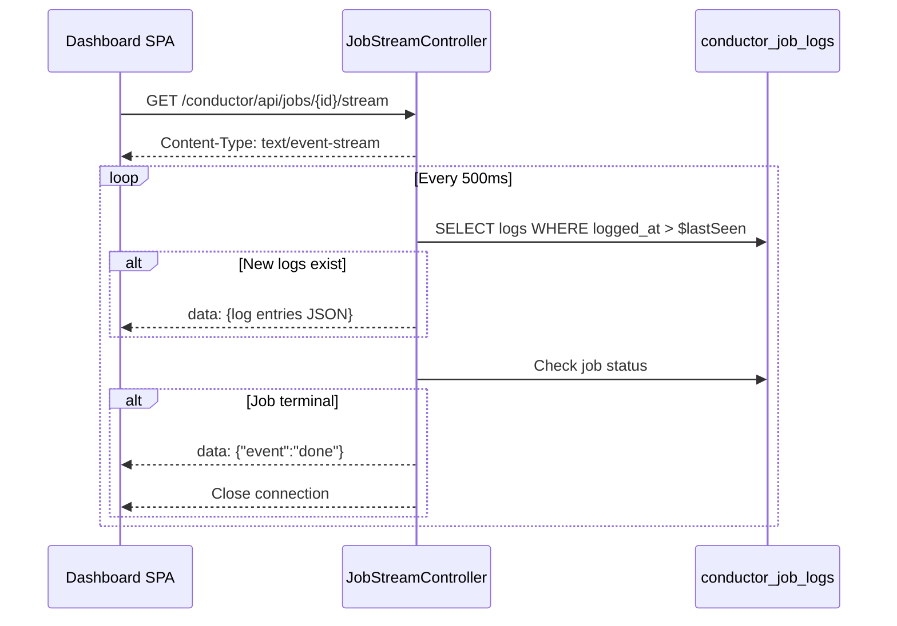

# Phase 7: Dashboard API

I have created the following plan after thorough exploration and analysis of the codebase. Follow the below plan verbatim. Trust the files and references. Do not re-verify what's written in the plan. Explore only when absolutely necessary. First implement all the proposed file changes and then I'll review all the changes together at the end.

## Observations

Phase 1 established the API route group at `/conductor/api/*` with `Authorize` middleware. Phase 2 created all models with relationships, scopes, and factories. Phase 3 built job tracking, retry, and cancellation services (`JobRetryService`, `JobCancellationService`). Phase 4 built the workflow engine and `WorkflowCancellationService`. Phase 5 implemented events, schedule toggle service, and webhook ingestion. Phase 6 added worker heartbeats, metric snapshots, and Artisan commands. The API route file (`routes/api.php`) is currently empty. All API endpoints return JSON and are protected by the `Authorize` middleware applied at the route group level.

## Approach

Phase 7 implements all 14 JSON API endpoints consumed by the dashboard SPA, plus the SSE streaming endpoint. Each endpoint delegates to the appropriate service or queries models directly for read operations. Controllers are thin — they accept input, delegate to services, and return JSON resources. Eloquent API Resources transform models into consistent JSON structures. The SSE endpoint uses a streaming response with a 500ms polling interval. All endpoints are registered in `routes/api.php`.

These endpoints are package-owned transport surfaces for the standalone SPA. They are intentionally ordinary JSON and SSE routes rather than Inertia responses so the package remains decoupled from the host application's frontend stack.

---

## - [x] 1. Eloquent API Resources

Create API resources in `src/Http/Resources/`. Each is `final` and defines `toArray(Request $request): array`.

### 1.1 `ConductorJobResource.php`

**Exposed fields:**
| Field | Source | Notes |
|---|---|---|
| `id` | `uuid` | External identifier |
| `class` | `class` | |
| `display_name` | `display_name` | |
| `status` | `status->value` | String value of enum |
| `queue` | `queue` | |
| `connection` | `connection` | |
| `tags` | `tags` | Array |
| `attempts` | `attempts` | |
| `max_attempts` | `max_attempts` | |
| `is_cancellable` | `isCancellable()` | Computed |
| `started_at` | `started_at?->toIso8601String()` | |
| `completed_at` | `completed_at?->toIso8601String()` | |
| `failed_at` | `failed_at?->toIso8601String()` | |
| `cancelled_at` | `cancelled_at?->toIso8601String()` | |
| `duration_ms` | `duration_ms` | |
| `error_message` | `error_message` | |
| `stack_trace` | `stack_trace` | Only when loaded (detail view) |
| `created_at` | `created_at->toIso8601String()` | |

**Never exposed:** `payload` (may contain sensitive data even after redaction), `cancellable_at`, `cancellation_requested_at` (internal lifecycle fields).

**Conditional fields:** `stack_trace` and `logs` are included only when the resource is loaded with `$this->whenLoaded('logs')`.

### 1.2 `ConductorJobLogResource.php`

| Field | Source |
|---|---|
| `id` | `id` |
| `level` | `level->value` |
| `message` | `message` |
| `logged_at` | `logged_at->toIso8601String()` |

### 1.3 `ConductorWorkflowResource.php`

| Field | Source |
|---|---|
| `id` | `uuid` |
| `class` | `class` |
| `display_name` | `display_name` |
| `status` | `status->value` |
| `current_step_index` | `current_step_index` |
| `step_count` | `steps_count` (when loaded) or `steps->count()` |
| `created_at` | `created_at->toIso8601String()` |
| `completed_at` | `completed_at?->toIso8601String()` |
| `cancelled_at` | `cancelled_at?->toIso8601String()` |

**Conditional:** `steps` → `ConductorWorkflowStepResource::collection($this->whenLoaded('steps'))`

### 1.4 `ConductorWorkflowStepResource.php`

| Field | Source |
|---|---|
| `id` | `id` |
| `name` | `name` |
| `step_index` | `step_index` |
| `status` | `status->value` |
| `attempts` | `attempts` |
| `started_at` | `started_at?->toIso8601String()` |
| `completed_at` | `completed_at?->toIso8601String()` |
| `duration_ms` | `duration_ms` |
| `error_message` | `error_message` |
| `output` | `output` |

### 1.5 `ConductorEventResource.php`

| Field | Source |
|---|---|
| `id` | `uuid` |
| `name` | `name` |
| `payload` | `payload` |
| `dispatched_at` | `dispatched_at->toIso8601String()` |
| `runs_count` | `runs_count` (when loaded) |

**Conditional:** `runs` → `ConductorEventRunResource::collection($this->whenLoaded('runs'))`

### 1.6 `ConductorEventRunResource.php`

| Field | Source |
|---|---|
| `id` | `id` |
| `function_class` | `function_class` |
| `status` | `status->value` |
| `error_message` | `error_message` |
| `attempts` | `attempts` |
| `started_at` | `started_at?->toIso8601String()` |
| `completed_at` | `completed_at?->toIso8601String()` |
| `duration_ms` | `duration_ms` |

### 1.7 `ConductorScheduleResource.php`

| Field | Source |
|---|---|
| `id` | `id` |
| `function_class` | `function_class` |
| `display_name` | `display_name` |
| `cron_expression` | `cron_expression` |
| `is_active` | `is_active` |
| `last_run_at` | `last_run_at?->toIso8601String()` |
| `next_run_at` | `next_run_at?->toIso8601String()` |
| `last_run_status` | `last_run_status?->value` |

### 1.8 `ConductorWorkerResource.php`

| Field | Source |
|---|---|
| `id` | `worker_uuid` |
| `worker_name` | `worker_name` |
| `queue` | `queue` |
| `connection` | `connection` |
| `hostname` | `hostname` |
| `process_id` | `process_id` |
| `status` | `derivedStatus()->value` |
| `current_job_uuid` | `current_job_uuid` |
| `last_heartbeat_at` | `last_heartbeat_at->toIso8601String()` |

### 1.9 `ConductorMetricResource.php`

| Field | Source |
|---|---|
| `metric` | `metric->value` |
| `queue` | `queue` |
| `value` | `value` |
| `recorded_at` | `recorded_at->toIso8601String()` |

---

## - [x] 2. Job API Controller

**`src/Http/Controllers/Api/JobController.php`**

A resource-style controller (not invokable). All methods return JSON.

### `index(Request $request): AnonymousResourceCollection`

1. Query `ConductorJob` with optional filters:
   - `status` query param → `withStatus()` scope
   - `queue` query param → `onQueue()` scope
   - `tag` query param → `whereJsonContains('tags', $request->query('tag'))`
2. Order by `created_at` descending.
3. Paginate with `perPage` from query param (default 15, max 100).
4. Return `ConductorJobResource::collection($jobs)`.

### `show(Request $request, ConductorJob $job): ConductorJobResource`

1. Eager load `logs` (ordered by `logged_at`).
2. Return `ConductorJobResource` for the job.

### `retry(ConductorJob $job): JsonResponse`

1. Delegate to `JobRetryService::retry($job)`.
2. Return `200` with `{"message": "Job retry dispatched."}`.
3. Catch `InvalidArgumentException` → return `422` with error message.

### `destroy(ConductorJob $job): JsonResponse`

1. Delegate to `JobCancellationService::cancel($job)`.
2. Return `200` with `{"message": "Job cancellation requested."}`.
3. Catch `LogicException` → return `422` with error message.
4. Catch `InvalidArgumentException` → return `422` with error message.

---

## - [x] 3. SSE Stream Controller

**`src/Http/Controllers/Api/JobStreamController.php`**

Invokable controller that returns a Server-Sent Events stream for realtime log viewing.

### `__invoke(Request $request, ConductorJob $job): StreamedResponse`

1. Return a `StreamedResponse` with:
   - `Content-Type: text/event-stream`
   - `Cache-Control: no-cache`
   - `Connection: keep-alive`
   - `X-Accel-Buffering: no` (for nginx proxy support)
2. Inside the streaming callback:
   a. Initialize `$lastSeen` to `now()->subSeconds(1)` (or from `Last-Event-ID` header if present).
   b. Loop with a 500ms sleep interval (`usleep(500_000)`):
      - Query `ConductorJobLog::where('job_id', $job->id)->where('logged_at', '>', $lastSeen)->orderBy('logged_at')->get()`.
      - For each new log entry, emit `data: ` followed by JSON-encoded `ConductorJobLogResource` and double newline.
      - Update `$lastSeen` to the newest `logged_at`.
      - Refresh the `$job` model from database (to check terminal status).
      - If the job's `status->isTerminal()`, emit `data: {"event":"done"}` and break.
      - Flush the output buffer: `ob_flush(); flush();`.
      - Check `connection_aborted()` → break if client disconnected.



---

## - [x] 4. Workflow API Controller

**`src/Http/Controllers/Api/WorkflowController.php`**

### `index(Request $request): AnonymousResourceCollection`

1. Query `ConductorWorkflow` with optional `status` filter.
2. Eager load `withCount('steps')`.
3. Order by `created_at` descending.
4. Paginate (default 15, max 100).
5. Return `ConductorWorkflowResource::collection($workflows)`.

### `show(Request $request, ConductorWorkflow $workflow): ConductorWorkflowResource`

1. Eager load `steps` (ordered by `step_index`).
2. Return `ConductorWorkflowResource`.

### `destroy(ConductorWorkflow $workflow): JsonResponse`

1. Delegate to `WorkflowCancellationService::cancel($workflow)`.
2. Return `200` with `{"message": "Workflow cancellation requested."}`.
3. Catch `InvalidArgumentException` → return `422`.

---

## - [x] 5. Event API Controller

**`src/Http/Controllers/Api/EventController.php`**

### `index(Request $request): AnonymousResourceCollection`

1. Query `ConductorEvent` with optional `name` filter.
2. Eager load `withCount('runs')`.
3. Order by `dispatched_at` descending.
4. Paginate (default 15, max 100).
5. Return `ConductorEventResource::collection($events)`.

### `show(Request $request, ConductorEvent $event): ConductorEventResource`

1. Eager load `runs`.
2. Return `ConductorEventResource`.

---

## - [x] 6. Schedule API Controller

**`src/Http/Controllers/Api/ScheduleController.php`**

### `index(Request $request): AnonymousResourceCollection`

1. Query all `ConductorSchedule` records.
2. Order by `function_class`.
3. Return `ConductorScheduleResource::collection($schedules)` (no pagination — schedules are a small fixed set).

### `toggle(ConductorSchedule $schedule): ConductorScheduleResource`

1. Delegate to `ScheduleToggleService::toggle($schedule)`.
2. Return the updated `ConductorScheduleResource`.

---

## - [x] 7. Worker API Controller

**`src/Http/Controllers/Api/WorkerController.php`**

### `index(Request $request): AnonymousResourceCollection`

1. Check if the queue driver is `sync`. If so, return a JSON response with `{"sync_driver": true, "message": "Worker health is not available with the sync queue driver.", "data": []}`.
2. Query all `ConductorWorker` records.
3. Order by `queue`, then `worker_name`.
4. Return `ConductorWorkerResource::collection($workers)`.

---

## - [x] 8. Metrics API Controller

**`src/Http/Controllers/Api/MetricsController.php`**

### `index(Request $request): JsonResponse`

1. Read the `window` query param. Validate it is one of `1h`, `24h`, `7d`. Default to `24h`.
2. Calculate the start timestamp based on the window: `now()->subHour()`, `now()->subDay()`, or `now()->subWeek()`.
3. Query `ConductorMetricSnapshot` where `recorded_at >= $start`.
4. Group the results by `metric` value.
5. Return a JSON structure:

```json
{
  "window": "24h",
  "throughput": [{ "value": 120, "recorded_at": "..." }, ...],
  "failure_rate": [{ "value": 0.05, "recorded_at": "..." }, ...],
  "queue_depth": {
    "default": [{ "value": 15, "recorded_at": "..." }, ...],
    "high": [{ "value": 3, "recorded_at": "..." }, ...]
  }
}
```

The `queue_depth` data is additionally grouped by `queue` value.

---

## - [x] 9. API Route Registration

**Update `routes/api.php`:**

Register all API endpoints:

| Method | URI | Controller | Action | Route Name |
|---|---|---|---|---|
| `GET` | `/jobs` | `JobController` | `index` | `conductor.api.jobs.index` |
| `GET` | `/jobs/{job}` | `JobController` | `show` | `conductor.api.jobs.show` |
| `POST` | `/jobs/{job}/retry` | `JobController` | `retry` | `conductor.api.jobs.retry` |
| `DELETE` | `/jobs/{job}` | `JobController` | `destroy` | `conductor.api.jobs.destroy` |
| `GET` | `/jobs/{job}/stream` | `JobStreamController` | `__invoke` | `conductor.api.jobs.stream` |
| `GET` | `/workflows` | `WorkflowController` | `index` | `conductor.api.workflows.index` |
| `GET` | `/workflows/{workflow}` | `WorkflowController` | `show` | `conductor.api.workflows.show` |
| `DELETE` | `/workflows/{workflow}` | `WorkflowController` | `destroy` | `conductor.api.workflows.destroy` |
| `GET` | `/events` | `EventController` | `index` | `conductor.api.events.index` |
| `GET` | `/events/{event}` | `EventController` | `show` | `conductor.api.events.show` |
| `GET` | `/schedules` | `ScheduleController` | `index` | `conductor.api.schedules.index` |
| `POST` | `/schedules/{schedule}/toggle` | `ScheduleController` | `toggle` | `conductor.api.schedules.toggle` |
| `GET` | `/metrics` | `MetricsController` | `index` | `conductor.api.metrics.index` |
| `GET` | `/workers` | `WorkerController` | `index` | `conductor.api.workers.index` |

**Route model binding:** Jobs, workflows, and events bind by `uuid`. Schedules bind by `id`. The `getRouteKeyName()` methods defined on the models in Phase 2 handle this automatically.

---

## - [x] 10. Tests

### Feature Tests

**`tests/Feature/Api/JobApiTest.php`**
- `it returns a paginated list of jobs` — Create 20 jobs. GET `/conductor/api/jobs`. Assert 200, paginated response with 15 items.
- `it filters jobs by status` — Create jobs with different statuses. GET `/conductor/api/jobs?status=failed`. Assert only failed jobs returned.
- `it filters jobs by queue` — Create jobs on different queues. Filter by queue. Assert correct filtering.
- `it filters jobs by tag` — Create tagged and untagged jobs. Filter by tag. Assert correct results.
- `it returns job detail with logs` — Create a job with 3 log entries. GET `/conductor/api/jobs/{uuid}`. Assert logs are included.
- `it retries a failed job` — Create a failed job. POST `/conductor/api/jobs/{uuid}/retry`. Assert 200 and job status reset.
- `it rejects retry on non-failed job` — Create a completed job. POST retry. Assert 422.
- `it cancels a pending job` — Create a pending job. DELETE `/conductor/api/jobs/{uuid}`. Assert 200 and job cancelled.
- `it rejects cancellation of terminal job` — DELETE a completed job. Assert 422.
- `it blocks unauthenticated access` — Set environment to production, no gate. GET `/conductor/api/jobs`. Assert 403.

**`tests/Feature/Api/JobStreamApiTest.php`**
- `it returns an SSE response with correct headers` — GET `/conductor/api/jobs/{uuid}/stream`. Assert response has `Content-Type: text/event-stream`.
- `it streams log entries as SSE data` — Create a job with log entries. Start stream. Assert data events contain log content.

**`tests/Feature/Api/WorkflowApiTest.php`**
- `it returns a paginated list of workflows` — Create 5 workflows. GET `/conductor/api/workflows`. Assert 200 with data.
- `it returns workflow detail with steps` — Create a workflow with 3 steps. GET `/conductor/api/workflows/{uuid}`. Assert steps included.
- `it cancels a running workflow` — DELETE `/conductor/api/workflows/{uuid}`. Assert 200.

**`tests/Feature/Api/EventApiTest.php`**
- `it returns a paginated list of events` — Create 5 events. GET `/conductor/api/events`. Assert 200.
- `it returns event detail with runs` — Create an event with 2 runs. GET `/conductor/api/events/{uuid}`. Assert runs included.

**`tests/Feature/Api/ScheduleApiTest.php`**
- `it returns all schedules` — Create 3 schedules. GET `/conductor/api/schedules`. Assert 200 with 3 items.
- `it toggles a schedule` — Create an active schedule. POST `/conductor/api/schedules/{id}/toggle`. Assert `is_active` flipped.

**`tests/Feature/Api/WorkerApiTest.php`**
- `it returns worker list` — Create 2 workers. GET `/conductor/api/workers`. Assert 200 with derived status.
- `it returns sync driver notice when using sync driver` — Set queue driver to sync. GET `/conductor/api/workers`. Assert response contains `sync_driver` flag.

**`tests/Feature/Api/MetricsApiTest.php`**
- `it returns metrics for default 24h window` — Create metric snapshots. GET `/conductor/api/metrics`. Assert data grouped by metric type.
- `it accepts window parameter` — GET `/conductor/api/metrics?window=1h`. Assert only snapshots within the last hour.
- `it groups queue_depth by queue` — Create queue depth snapshots for multiple queues. Assert response structure.
