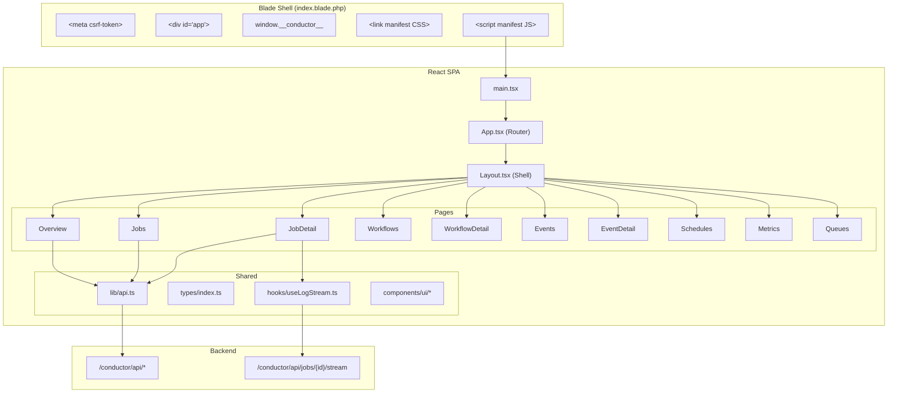

# Phase 8: Dashboard SPA

I have created the following plan after thorough exploration and analysis of the codebase. Follow the below plan verbatim. Trust the files and references. Do not re-verify what's written in the plan. Explore only when absolutely necessary. First implement all the proposed file changes and then I'll review all the changes together at the end.

## Observations

Phase 1 established the Blade shell view (`resources/views/index.blade.php`) with a `<div id="app">` mount point. Phase 6 implemented `conductor:publish` which copies `resources/dist/` to `public/vendor/conductor/`. Phase 7 built all API endpoints under `/conductor/api/*` returning JSON. The current `package.json` has only commitlint and lefthook as dev dependencies — no frontend framework. The PRD specifies a React + shadcn/ui SPA with Vite, compiled output committed to `resources/dist/`, content-hash filenames, and a `manifest.json` read by the Blade shell. The SPA communicates via fetch-based JSON API (no Inertia).

## Approach

Phase 8 builds the self-contained React SPA dashboard. The frontend tooling (Vite, React, TypeScript, Tailwind CSS, shadcn/ui) is configured within the package itself — isolated from the host application. The compiled output goes to `resources/dist/` and is committed to git (same as Horizon/Telescope). The Blade shell reads `resources/dist/.vite/manifest.json` to resolve content-hashed asset URLs. The SPA uses React Router for client-side navigation across 9 pages. API communication uses a fetch wrapper that reads the `XSRF-TOKEN` cookie. SSE log streaming uses the EventSource API with a polling fallback. All frontend code lives in `resources/js/`.

## Visual References

The `art/` directory contains approved design screenshots for every page in the dashboard. Implement the UI to match these references precisely — layout, typography, color palette, spacing, and component style.

| Page | Screenshot |
|---|---|
| Overview | `art/overview.png` |
| Jobs list | `art/jobs-list.png` |
| Job detail | `art/job-detail.png` |
| Workflows list | `art/workflows-list.png` |
| Workflow detail | `art/workflow-detail.png` |
| Events list | `art/events-list.png` |
| Event detail | `art/event-detail.png` |
| Schedules | `art/schedules.png` |
| Metrics | `art/metrics.png` |
| Queues | `art/queues.png` |

**Design system notes from the references:**
- Dark background (`#0a0a0a` / near-black), with slightly elevated card surfaces (`#111` / `#141414`)
- Primary accent: bright green (`#4ade80` / Tailwind `green-400`) — used for active status dots, nav highlights, and the logo mark
- Monospace font for job class names, IDs, cron expressions, and log output
- Status badge colors: Completed = green, Running = amber/orange, Failed = red, Pending = muted gray, Cancelled = muted gray
- Sidebar is fixed-width (~180px), shows nav label + icon, active item highlighted with green left-border or green text
- Tables are borderless with subtle row separators; column headers in small-caps muted gray
- Stat cards on Overview use a 4-column grid with icon + value + label layout

---

## - [ ] 1. Frontend Tooling Setup

### 1.1 Update `package.json`

Add the following dev dependencies:

| Package | Version | Purpose |
|---|---|---|
| `react` | `^19.0` | UI framework |
| `react-dom` | `^19.0` | React DOM renderer |
| `@types/react` | `^19.0` | TypeScript types |
| `@types/react-dom` | `^19.0` | TypeScript types |
| `typescript` | `^5.7` | TypeScript compiler |
| `vite` | `^6.0` | Build tool |
| `@vitejs/plugin-react` | `^4.0` | React Fast Refresh |
| `tailwindcss` | `^4.0` | CSS framework |
| `@tailwindcss/vite` | `^4.0` | Tailwind Vite plugin |
| `react-router` | `^7.0` | Client-side routing |
| `recharts` | `^2.15` | Chart library for metrics |
| `clsx` | `^2.0` | Classname utility |
| `tailwind-merge` | `^3.0` | Tailwind class merging |

Add scripts:
- `"dev": "vite"` — Development server with HMR
- `"build": "tsc && vite build"` — Production build

### 1.2 Create `tsconfig.json`

Standard React TypeScript config:
- `target`: `ES2022`
- `module`: `ESNext`
- `jsx`: `react-jsx`
- `strict`: `true`
- `moduleResolution`: `bundler`
- `paths`: `{ "@/*": ["./resources/js/*"] }`
- `include`: `["resources/js"]`

### 1.3 Create `vite.config.ts`

- `root`: `resources/js`
- `base`: `/vendor/conductor/` (matches the published asset path)
- `plugins`: `[react(), tailwindcss()]`
- `build.outDir`: `../../resources/dist`
- `build.emptyOutDir`: `true`
- `build.manifest`: `true` (generates `.vite/manifest.json`)
- `build.rollupOptions.input`: `resources/js/main.tsx`

---

## - [ ] 2. Blade Shell Manifest Reader

**Update `resources/views/index.blade.php`** (created in Phase 1):

Replace the placeholder asset references with a manifest reader:

1. Read the manifest file at `__DIR__ . '/../dist/.vite/manifest.json'`. Parse as JSON.
2. Look up the entry point key `resources/js/main.tsx` in the manifest.
3. Extract the `css` array and `file` path from the manifest entry.
4. Render `<link>` tags for each CSS file with `href` pointing to `/vendor/conductor/{path}`.
5. Render a `<script type="module">` tag with `src` pointing to `/vendor/conductor/{file}`.
6. If the manifest file does not exist (assets not published), show a friendly error message: "Conductor assets not published. Run: php artisan conductor:publish".

**Pass configuration to the SPA via a `<script>` tag:**

```html
<script>
  window.__conductor__ = {
    basePath: "{{ config('conductor.path', 'conductor') }}"
  };
</script>
```

This provides the SPA with the route prefix needed for API URL construction. CSRF protection continues to use Laravel's `XSRF-TOKEN` cookie.

---

## - [ ] 3. CSS Entry Point

**`resources/js/app.css`**

Import Tailwind CSS v4:
```css
@import "tailwindcss";
```

Define the Conductor-specific color tokens (shadcn/ui convention) as CSS custom properties under `:root` and `.dark`. Use a neutral color palette that works in both the host application's context and standalone:

- Background, foreground, card, popover, primary, secondary, muted, accent, destructive, border, input, ring colors.
- Define both light and dark mode variants.

---

## - [ ] 4. SPA Entry Point & API Client

### 4.1 `resources/js/main.tsx`

The React entry point:
1. Import `app.css`.
2. Import the root `App` component.
3. Call `createRoot(document.getElementById('app')!)` and render `<App />`.

### 4.2 `resources/js/lib/api.ts`

A fetch wrapper for all API communication.

**Functions:**

- `apiUrl(path: string): string` — Constructs the full API URL: `/${window.__conductor__.basePath}/api${path}`.
- `apiFetch<T>(path: string, options?: RequestInit): Promise<T>` — Wraps `fetch()` with:
  - `Content-Type: application/json`
  - `Accept: application/json`
  - `X-XSRF-TOKEN` header read from the `XSRF-TOKEN` cookie (decodeURIComponent). This is the standard Laravel CSRF mechanism for SPAs.
  - `X-Requested-With: XMLHttpRequest`
  - On non-2xx response, throw an error with the response body.
- `apiGet<T>(path: string): Promise<T>` — Shorthand for GET requests.
- `apiPost<T>(path: string, body?: unknown): Promise<T>` — Shorthand for POST with JSON body.
- `apiDelete<T>(path: string): Promise<T>` — Shorthand for DELETE.

### 4.3 `resources/js/lib/utils.ts`

Utility functions:
- `cn(...classes: ClassValue[]): string` — Combines `clsx` and `tailwind-merge` for className composition (standard shadcn/ui utility).
- `formatDuration(ms: number | null): string` — Formats milliseconds to human-readable duration (e.g. "2.5s", "1m 30s").
- `formatRelativeTime(iso: string): string` — Formats ISO timestamp to relative time (e.g. "2 minutes ago").
- `statusColor(status: string): string` — Maps status values to Tailwind color classes for badges.

---

## - [ ] 5. TypeScript Types

**`resources/js/types/index.ts`**

Define TypeScript interfaces matching the API resource shapes from Phase 7:

```typescript
interface ConductorJob {
  id: string;
  class: string;
  display_name: string;
  status: JobStatus;
  queue: string | null;
  connection: string | null;
  tags: string[];
  attempts: number;
  max_attempts: number | null;
  is_cancellable: boolean;
  started_at: string | null;
  completed_at: string | null;
  failed_at: string | null;
  cancelled_at: string | null;
  duration_ms: number | null;
  error_message: string | null;
  stack_trace: string | null;
  logs?: ConductorJobLog[];
  created_at: string;
}

type JobStatus = 'pending' | 'running' | 'completed' | 'failed' | 'cancellation_requested' | 'cancelled';

interface ConductorJobLog {
  id: number;
  level: 'debug' | 'info' | 'warning' | 'error';
  message: string;
  logged_at: string;
}

interface ConductorWorkflow {
  id: string;
  class: string;
  display_name: string;
  status: WorkflowStatus;
  current_step_index: number;
  step_count: number;
  steps?: ConductorWorkflowStep[];
  created_at: string;
  completed_at: string | null;
  cancelled_at: string | null;
}

type WorkflowStatus = 'pending' | 'running' | 'waiting' | 'completed' | 'failed' | 'cancelled';

interface ConductorWorkflowStep {
  id: number;
  name: string;
  step_index: number;
  status: 'pending' | 'running' | 'completed' | 'failed' | 'skipped';
  attempts: number;
  started_at: string | null;
  completed_at: string | null;
  duration_ms: number | null;
  error_message: string | null;
  output: unknown;
}

interface ConductorEvent {
  id: string;
  name: string;
  payload: Record<string, unknown>;
  dispatched_at: string;
  runs_count: number;
  runs?: ConductorEventRun[];
}

interface ConductorEventRun {
  id: number;
  function_class: string;
  status: 'pending' | 'running' | 'completed' | 'failed';
  error_message: string | null;
  attempts: number;
  started_at: string | null;
  completed_at: string | null;
  duration_ms: number | null;
}

interface ConductorSchedule {
  id: number;
  function_class: string;
  display_name: string;
  cron_expression: string;
  is_active: boolean;
  last_run_at: string | null;
  next_run_at: string | null;
  last_run_status: 'completed' | 'failed' | null;
}

interface ConductorWorker {
  id: string;
  worker_name: string;
  queue: string;
  connection: string;
  hostname: string;
  process_id: number;
  status: 'idle' | 'busy' | 'offline';
  current_job_uuid: string | null;
  last_heartbeat_at: string;
}

interface MetricsResponse {
  window: '1h' | '24h' | '7d';
  throughput: MetricPoint[];
  failure_rate: MetricPoint[];
  queue_depth: Record<string, MetricPoint[]>;
}

interface MetricPoint {
  value: number;
  recorded_at: string;
}

interface PaginatedResponse<T> {
  data: T[];
  meta: {
    current_page: number;
    last_page: number;
    per_page: number;
    total: number;
  };
  links: {
    first: string;
    last: string;
    prev: string | null;
    next: string | null;
  };
}
```

---

## - [ ] 6. Shared UI Components

Create reusable UI components in `resources/js/components/ui/` following shadcn/ui patterns. Each component is a single file exporting a React component.

### Required components:

| Component | File | Purpose |
|---|---|---|
| `Badge` | `badge.tsx` | Status badges with color variants |
| `Button` | `button.tsx` | Action buttons with size/variant props |
| `Card` | `card.tsx` | Card container with header/content/footer sections |
| `Table` | `table.tsx` | Data table with header, body, row components |
| `Pagination` | `pagination.tsx` | Page navigation controls |
| `Tabs` | `tabs.tsx` | Tab navigation (for metrics time windows) |
| `Toggle` | `toggle.tsx` | Toggle switch (for schedule enable/disable) |
| `Skeleton` | `skeleton.tsx` | Loading placeholder |
| `Alert` | `alert.tsx` | Info/warning/error messages |
| `ScrollArea` | `scroll-area.tsx` | Scrollable container (for log output) |
| `Separator` | `separator.tsx` | Visual divider |
| `DropdownMenu` | `dropdown-menu.tsx` | Action menus on job/workflow rows |

All components use `cn()` for className composition and accept standard HTML attributes via `React.ComponentPropsWithoutRef<>`.

---

## - [ ] 7. Application Shell & Navigation

**`resources/js/components/App.tsx`**

The root component:
1. Sets up `BrowserRouter` with `basename` set to `/${window.__conductor__.basePath}`.
2. Wraps routes in a `Layout` component.
3. Defines `Routes` with all page routes (see section 8).

**`resources/js/components/Layout.tsx`**

The dashboard shell:
1. Sidebar navigation with links to: Overview, Jobs, Workflows, Events, Schedules, Metrics, Queues.
2. Each nav item shows the page name and an icon.
3. Active page is highlighted based on current route.
4. Main content area renders the matched route's page component via `<Outlet />`.
5. Header bar with "Conductor" title.

---

## - [ ] 8. Page Components

All pages in `resources/js/pages/`. Each page fetches data from the API on mount using `useEffect` and `apiGet`.

### 8.1 `resources/js/pages/Overview.tsx`

> **Visual reference:** `art/overview.png`

**Summary cards:**
- Total Jobs (query: count all jobs)
- Failed Jobs (query: count failed jobs)
- Active Workflows (query: count running workflows)
- Queue Depth (sum of pending jobs)

**Recent activity feed:** Last 10 jobs/events ordered by timestamp, showing status badge, display name, and relative time.

**Data fetching:** GET `/jobs?per_page=10`, GET `/workflows?status=running`, GET `/metrics?window=1h`.

### 8.2 `resources/js/pages/Jobs.tsx`

> **Visual reference:** `art/jobs-list.png`

**Filterable list:**
- Status filter dropdown (all, pending, running, completed, failed, cancelled)
- Queue filter dropdown (populated from distinct queues in results)
- Tag filter text input

**Table columns:** Status (badge), Display Name, Queue, Attempts, Duration, Created At.

**Row click:** Navigate to `/jobs/{id}`.

**Pagination:** Use `PaginatedResponse` meta.

**Data fetching:** GET `/jobs` with query params.

### 8.3 `resources/js/pages/JobDetail.tsx`

> **Visual reference:** `art/job-detail.png`

**Route:** `/jobs/:id`

**Sections:**
1. **Header:** Display name, status badge, retry/cancel action buttons.
2. **Metadata grid:** Class, Queue, Connection, Attempts/Max Attempts, Started At, Completed At, Duration.
3. **Error section** (if failed): Error message and collapsible stack trace.
4. **Log output:** Scrollable area showing log entries. If job is running, connect to SSE stream (see section 10). Each log line shows level badge, message, and timestamp.

**Actions:**
- Retry button (visible when status is `failed`): POST `/jobs/{id}/retry`, refresh page.
- Cancel button (visible when `is_cancellable` is `true`): DELETE `/jobs/{id}`, refresh page.

**Data fetching:** GET `/jobs/{id}`.

### 8.4 `resources/js/pages/Workflows.tsx`

> **Visual reference:** `art/workflows-list.png`

**Filterable list:**
- Status filter dropdown

**Table columns:** Status, Display Name, Steps (completed/total), Created At, Completed/Cancelled At.

**Row click:** Navigate to `/workflows/{id}`.

**Data fetching:** GET `/workflows` with query params.

### 8.5 `resources/js/pages/WorkflowDetail.tsx`

> **Visual reference:** `art/workflow-detail.png`

**Route:** `/workflows/:id`

**Sections:**
1. **Header:** Display name, status badge, cancel button.
2. **Metadata:** Class, Created At, Completed At.
3. **Step timeline:** Vertical timeline showing each step with:
   - Step index and name
   - Status badge
   - Duration
   - Output (collapsible JSON viewer)
   - Error message (if failed)
   - Attempt count

**Cancel action:** DELETE `/workflows/{id}`, refresh page.

**Data fetching:** GET `/workflows/{id}`.

### 8.6 `resources/js/pages/Events.tsx`

> **Visual reference:** `art/events-list.png`

**Filterable list:**
- Event name filter text input

**Table columns:** Name, Runs Count, Dispatched At.

**Row click:** Navigate to `/events/{id}`.

**Data fetching:** GET `/events` with query params.

### 8.7 `resources/js/pages/EventDetail.tsx`

> **Visual reference:** `art/event-detail.png`

**Route:** `/events/:id`

**Sections:**
1. **Header:** Event name, dispatched at.
2. **Payload viewer:** Formatted JSON display.
3. **Triggered runs table:** Function Class, Status, Attempts, Duration, Error.

**Data fetching:** GET `/events/{id}`.

### 8.8 `resources/js/pages/Schedules.tsx`

> **Visual reference:** `art/schedules.png`

**Table columns:** Display Name, Function Class, Cron Expression, Active (toggle), Last Run At, Last Run Status, Next Run At.

**Toggle action:** POST `/schedules/{id}/toggle`, update the row inline.

**Data fetching:** GET `/schedules`.

### 8.9 `resources/js/pages/Metrics.tsx`

> **Visual reference:** `art/metrics.png`

**Time window tabs:** 1h, 24h, 7d.

**Charts (using Recharts):**
1. **Throughput** — Line chart showing jobs completed over time.
2. **Failure Rate** — Line chart showing failure rate percentage over time.
3. **Queue Depth** — Stacked area chart showing pending jobs per queue.

**Data fetching:** GET `/metrics?window={window}`. Re-fetch when tab changes.

### 8.10 `resources/js/pages/Queues.tsx`

> **Visual reference:** `art/queues.png`

**Sync driver notice:** If the API returns `sync_driver: true`, show an `Alert` component explaining that worker health is unavailable with the sync driver.

**Worker table columns:** Worker Name, Queue, Hostname, Status (badge), Current Job, Last Heartbeat.

**Status color mapping:** Idle → green, Busy → blue, Offline → red.

**Auto-refresh:** Poll GET `/workers` every 15 seconds.

**Data fetching:** GET `/workers`.

---

## - [ ] 9. React Router Configuration

**Inside `App.tsx`:**

| Path | Component | Description |
|---|---|---|
| `/` | `Overview` | Dashboard home |
| `/jobs` | `Jobs` | Job list |
| `/jobs/:id` | `JobDetail` | Job detail |
| `/workflows` | `Workflows` | Workflow list |
| `/workflows/:id` | `WorkflowDetail` | Workflow detail |
| `/events` | `Events` | Event list |
| `/events/:id` | `EventDetail` | Event detail |
| `/schedules` | `Schedules` | Schedule list |
| `/metrics` | `Metrics` | Metrics charts |
| `/queues` | `Queues` | Worker status |

---

## - [ ] 10. SSE Log Streaming Hook

**`resources/js/hooks/useLogStream.ts`**

A custom React hook for SSE log streaming with polling fallback.

**Signature:** `useLogStream(jobId: string, isRunning: boolean): ConductorJobLog[]`

**Behavior:**

1. If `isRunning` is `false`, return an empty array (no streaming needed).
2. Create an `EventSource` connection to `apiUrl(/jobs/${jobId}/stream)`.
3. On `message` event: parse the `data` as JSON, append to the log array.
4. On `data: {"event":"done"}`: close the connection.
5. On error (connection failed or closed unexpectedly): fall back to polling GET `/jobs/{jobId}` every 2 seconds, extracting new logs from the response.
6. On component unmount: close the EventSource connection.
7. Return the accumulated log entries array.

**Usage in `JobDetail.tsx`:** Merge the streamed logs with the initial logs loaded from the detail API call. Deduplicate by `id`.

---

## - [ ] 11. Asset Build & Publishing

### 11.1 Build Output

After running `npm run build`, the output in `resources/dist/` should contain:
- `assets/` directory with content-hashed JS and CSS files
- `.vite/manifest.json` mapping entry points to output files

### 11.2 Git Tracking

Add `resources/dist/` to version control (do NOT add it to `.gitignore`). This follows the Horizon/Telescope pattern.

### 11.3 Update `.gitignore`

Add `node_modules/` if not already present. Do NOT add `resources/dist/`.

### 11.4 Update Service Provider Asset Publishing

**Update `src/ConductorServiceProvider.php`:**

In `packageBooted()`, register the asset publishing:

```php
$this->publishes([
    __DIR__.'/../resources/dist' => public_path('vendor/conductor'),
], 'conductor-assets');
```

### 11.5 Release Workflow Enforcement

Create `.github/workflows/release.yml` to enforce up-to-date compiled assets before releases:

1. Run `npm ci` and `npm run build` on pushes to `main` and on release workflows.
2. Fail the workflow if `git diff --exit-code -- resources/dist` detects uncommitted build output after the build step.
3. Keep this workflow as the enforcement point ensuring tagged releases never ship stale dashboard assets.

---

## - [ ] 12. Development Workflow Documentation

Add a section to the package README (or CONTRIBUTING.md if it exists) documenting:

1. Install frontend dependencies: `npm install`
2. Start dev server: `npm run dev` (for HMR during development)
3. Build for production: `npm run build`
4. Commit the updated `resources/dist/` directory
5. Publish assets in host app: `php artisan conductor:publish`
6. PHP-FPM caveat: SSE log streams hold an HTTP connection open for the duration of a running job, so FPM pool sizing must account for concurrent log viewers.
7. Octane caveat: Conductor log capture is not fiber-safe inside the Octane web worker process; tracked jobs must run in separate `artisan queue:work` processes.
8. Release enforcement: CI verifies `resources/dist/` is current before releases are tagged.

---

## - [ ] 13. Tests

### Feature Tests

**`tests/Feature/DashboardViewTest.php`**
- `it renders the blade shell at the conductor path` — Create a test manifest file. GET `/conductor`. Assert 200, response contains `<div id="app">`, response contains the CSS link from manifest, response contains the JS script from manifest.
- `it shows an error message when assets are not published` — Remove the manifest file. GET `/conductor`. Assert the response contains the friendly error message about running `conductor:publish`.
- `it passes config values to the SPA via window.__conductor__` — GET `/conductor`. Assert the response contains `window.__conductor__` with the correct `basePath`.

**Note on frontend tests:** The SPA is tested primarily through its API integration. Unit tests for React components and hooks can be added using Vitest if desired, but they are outside the scope of this phase plan (they would live in `resources/js/__tests__/` and use JSDOM). The critical behavior — API communication, auth gating, route handling — is already tested through the PHP feature tests in Phase 7.

---

## - [ ] 14. SPA Architecture Diagram


